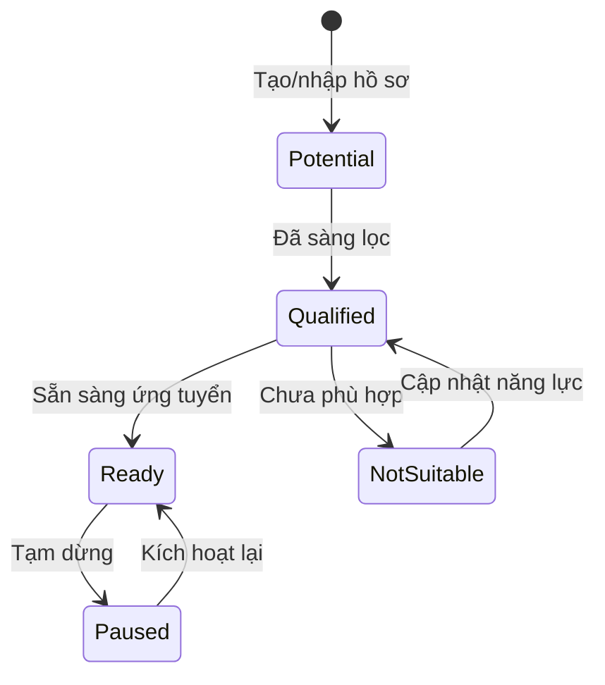
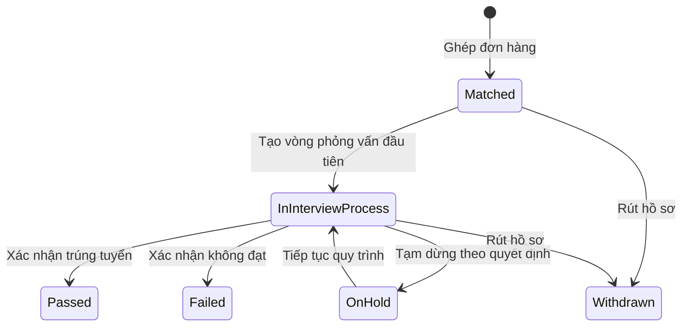
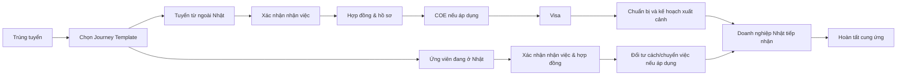

# 02. Vòng đời ứng viên và lộ trình cung ứng

## 1. Nguyên tắc tách trạng thái

Không dùng một trường trạng thái duy nhất cho toàn bộ quy trình. Ba đối tượng có vòng đời riêng:

- `Candidate`: hồ sơ gốc, mức sẵn sàng và khả năng liên hệ của một con người.
- `Application`: tiến trình ứng tuyển vào một đơn hàng cụ thể.
- `SupplyJourney`: lộ trình cung ứng sau trúng tuyển đến khi doanh nghiệp Nhật tiếp nhận.

Ngành/nghề không tạo thêm một vòng đời trạng thái. `IndustrySector`, `Occupation` và `VisaRoute` là danh mục tham chiếu; năng lực chuyên ngành nằm trong hồ sơ nghề của Candidate, còn yêu cầu tuyển cụ thể được snapshot trên Application.

Nhờ vậy, một ứng viên có thể trượt đơn hàng A nhưng vẫn đang chờ phỏng vấn đơn hàng B mà hồ sơ gốc không bị hiểu sai.

## 2. Trạng thái hồ sơ ứng viên

Không trộn tình trạng lưu trữ, mức sẵn sàng và khả năng liên hệ vào cùng một enum:

- `record_status`: `ACTIVE` hoặc `ARCHIVED`.
- `readiness_status`: `POTENTIAL`, `QUALIFIED`, `READY`, `PAUSED`, `NOT_SUITABLE`.
- `contactability_status`: `CONTACTABLE`, `TEMPORARILY_UNREACHABLE`, `DO_NOT_CONTACT`.

| Mã | Nhãn hiển thị | Ý nghĩa |
|---|---|---|
| `POTENTIAL` | Tiềm năng | Có dữ liệu cơ bản, chưa sàng lọc xong |
| `QUALIFIED` | Đã sàng lọc | Đạt tiêu chí hồ sơ ban đầu |
| `READY` | Sẵn sàng ứng tuyển | Có thể giới thiệu vào đơn hàng |
| `NOT_SUITABLE` | Chưa phù hợp | Giữ lại nhưng không dùng ngay |
| `PAUSED` | Tạm dừng | Ứng viên chưa muốn tiếp tục |

`TEMPORARILY_UNREACHABLE` và `DO_NOT_CONTACT` thuộc `contactability_status`; vì vậy một hồ sơ vẫn có thể là `READY` về năng lực nhưng tạm thời không được liên hệ.

Một Candidate có thể có nhiều `CandidateOccupationProfile`. Mỗi profile chỉ rõ ngành/nghề, số năm kinh nghiệm, kỹ năng, chứng chỉ, mức xác minh và tài liệu bằng chứng. IT dùng cùng mô hình này với tech stack/portfolio là thuộc tính chuyên ngành, không dùng bảng Candidate riêng.

## 3. Trạng thái lần ứng tuyển

Mỗi lần chuyển trạng thái phải ghi `from_status`, `to_status`, thời gian, người thực hiện, lý do và phiên bản bản ghi.

Khi Application được tạo, hệ thống lưu snapshot ngành/nghề, tuyến visa, kỹ năng, JLPT, điều kiện và version yêu cầu tuyển của JobOrder. Việc khách hàng sửa đơn hàng sau đó không được viết lại tiêu chí đã dùng để sàng lọc application cũ.

Trạng thái từng vòng nằm trên `Interview`, không đặt trên `Application`:

- `schedule_status`: `DRAFT`, `SCHEDULED`, `COMPLETED`, `CANCELLED`, `NO_SHOW`.
- `result`: `PENDING`, `ADVANCE_NEXT_ROUND`, `PASS`, `FAIL`.
- Đổi lịch giữ nguyên bản ghi vòng phỏng vấn và ghi lịch sử thời gian cũ/mới.

Hai danh sách người dùng yêu cầu là **saved view theo sự kiện**, không phải trạng thái loại trừ nhau:

- **Chờ phỏng vấn:** application đang hoạt động và tồn tại vòng `SCHEDULED` chưa diễn ra/chưa hoàn tất.
- **Đã phỏng vấn:** tồn tại ít nhất một vòng `COMPLETED`, bất kể đang chờ vòng sau, đã đỗ hay đã trượt.

Do đó một application đã xong vòng 1 và đã xếp vòng 2 sẽ xuất hiện đồng thời trong “Đã phỏng vấn” và “Chờ phỏng vấn”; đây là hành vi đúng.

## 4. Lộ trình cung ứng sang Nhật

`SupplyJourneyTemplate` được chọn theo nơi cư trú hiện tại, tuyến visa, trường hợp tuyển mới/chuyển việc và tùy chọn ngành/nghề. Template sinh các milestone thực tế cho journey; thay đổi template về sau không viết lại journey đã khởi tạo.

Một Candidate chỉ có tối đa một SupplyJourney hiệu lực (`ACTIVE` hoặc `ON_HOLD`) dù đã đỗ nhiều Application. Journey lịch sử đã `COMPLETED`/`CANCELLED` vẫn được giữ và không cản khởi tạo journey mới hợp lệ.

Mỗi mốc dùng enum `NOT_STARTED`, `IN_PROGRESS`, `COMPLETED`, `BLOCKED`, `WAIVED`, `NOT_APPLICABLE` và có ngày dự kiến, ngày hoàn tất, người phụ trách, checklist, tài liệu bắt buộc. `BLOCKED` kết hợp `blocker_party` để tạo view “Chờ ứng viên/đối tác”. `NOT_APPLICABLE` nghĩa là mốc không thuộc bối cảnh của journey; `WAIVED` nghĩa là mốc vốn áp dụng nhưng được người có thẩm quyền miễn trừ. Cả hai phải có lý do, còn `WAIVED` phải lưu thêm người duyệt và audit. Các mốc có thể xử lý song song nên không mô hình hóa lộ trình như một bước tuyến tính duy nhất. Chi tiết chuyến bay chỉ là dữ liệu tùy chọn trong mốc **Kế hoạch xuất cảnh** của template có xuất cảnh.

## 5. Quy tắc chuyển giao giữa bộ phận

| Sự kiện | Người bàn giao | Người nhận | Điều kiện tối thiểu |
|---|---|---|---|
| Sẵn sàng giới thiệu | Tuyển dụng | Kinh doanh | Hồ sơ đã sàng lọc, có chủ sở hữu |
| Xếp phỏng vấn | Kinh doanh/Tuyển dụng | Người phụ trách PV | Lịch, đơn hàng, người tham gia rõ ràng |
| Trúng tuyển | Tuyển dụng/Kinh doanh | Điều phối Nhật | Kết quả được xác nhận, chỉ định người điều phối |
| Chốt kế hoạch xuất cảnh | Điều phối Nhật | Quản lý/đầu mối tiếp nhận | Visa hợp lệ, chuẩn bị đạt, ngày xuất cảnh và đầu mối tiếp nhận được xác nhận |
| Hoàn tất cung ứng | Điều phối Nhật | Kinh doanh/Quản lý | Có xác nhận đã sang Nhật và doanh nghiệp Nhật đã tiếp nhận |

## 6. Ngoại lệ cần xử lý thủ công

- Ứng viên đổi email/số điện thoại hoặc dùng nhiều địa chỉ.
- Ứng viên phù hợp nhiều ngành/nghề hoặc chuyển ngành; profile cũ vẫn được giữ lịch sử và mức xác minh độc lập.
- Hai hồ sơ có dữ liệu giống nhau nhưng chưa đủ bằng chứng để hợp nhất.
- Ứng viên đỗ nhiều đơn hàng; quản lý phải xác nhận hành trình hiệu lực.
- COE/visa bị từ chối, hết hạn hoặc cần nộp lại.
- Ứng viên đổi ý sau trúng tuyển, khách hàng hủy/hoãn đơn hoặc đổi vị trí tiếp nhận.
- Kế hoạch xuất cảnh thay đổi; lịch/chặng bay (nếu có) được cập nhật như thông tin hỗ trợ, không làm thay đổi bản chất lộ trình.
- Chọn sai Journey Template hoặc tuyến visa thay đổi; phải tạo quyết định chuyển template/mốc có audit, không xóa lịch sử đã thực hiện.
- Email phản hồi không có token/thread hoặc gửi từ địa chỉ khác.
