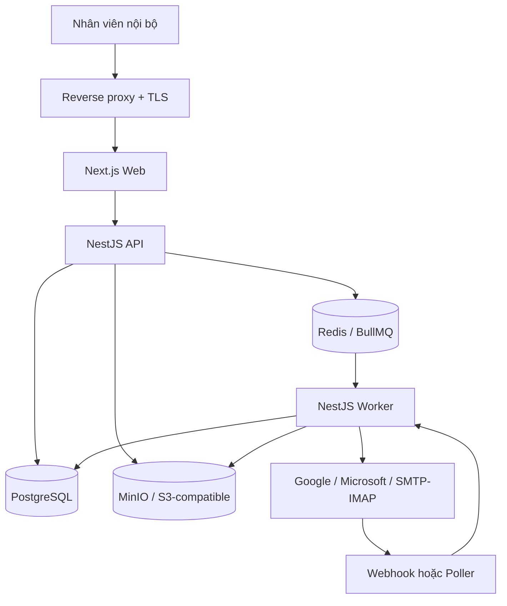
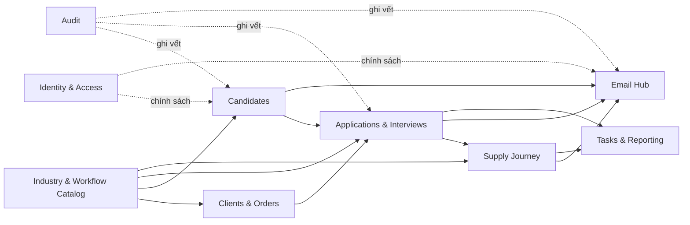

# 03. Kiến trúc hệ thống và stack công nghệ

## 1. Quyết định kiến trúc

Chọn **modular monolith**: một codebase backend, một cơ sở dữ liệu quan hệ, ranh giới module rõ ràng và tiến trình nền tách riêng. Đây là điểm cân bằng phù hợp cho khoảng 200 người dùng nội bộ: dễ triển khai và giao dịch nhất quán hơn microservices nhưng vẫn cho phép tách module khi tải hoặc đội phát triển tăng.

## 2. Sơ đồ logic

## 3. Stack đã chọn

| Lớp | Công nghệ | Lý do |
|---|---|---|
| Frontend | Next.js + TypeScript | CMS nhiều màn hình, routing và ecosystem tốt |
| Backend | NestJS + TypeScript | Cấu trúc module, validation, job worker và testability |
| ORM | Prisma | Schema rõ, migration có kiểm soát, type-safe query |
| CSDL | PostgreSQL | Giao dịch, ràng buộc, tìm kiếm và báo cáo phù hợp |
| Hàng đợi | Redis + BullMQ | Gửi/nhận email, scan tệp, retry, DLQ |
| Tệp | MinIO hoặc S3-compatible | Tách binary khỏi DB, hỗ trợ versioning và signed URL |
| Proxy | Nginx hoặc Caddy | TLS termination, routing, giới hạn request |
| Đóng gói | Docker + Docker Compose | Phù hợp tự vận hành trên Ubuntu, đơn giản hơn Kubernetes |
| Quan sát | Metrics + centralized logs + alerting | Theo dõi API, queue, email và dung lượng |

API nội bộ dùng REST dưới `/api/v1` và sinh OpenAPI làm hợp đồng cho Web, test và các tác vụ tích hợp. Dù frontend/backend cùng TypeScript, không chọn tRPC làm baseline vì cần ranh giới rõ giữa Next.js, NestJS, Worker/provider adapter và khả năng kiểm thử/đối soát độc lập.

## 4. Các module backend

`Industry & Workflow Catalog` quản lý ngành, nghề, tuyến visa, bộ yêu cầu, ngân hàng câu hỏi và Journey Template có version. Catalog chỉ định nghĩa cấu hình; trạng thái vận hành vẫn thuộc Candidate/Application/Interview/SupplyJourney và không bị viết ngược khi cấu hình thay đổi.

Ranh giới module được cưỡng chế ở code: module khác gọi qua service contract, không truy cập repository nội bộ tùy tiện. Giai đoạn đầu vẫn dùng chung PostgreSQL để giữ giao dịch đơn giản.

## 5. Tách tiến trình

| Tiến trình | Trách nhiệm | Quy tắc |
|---|---|---|
| Web | Render CMS và tài nguyên tĩnh | Không giữ secret backend |
| API | Xác thực, nghiệp vụ đồng bộ, query | Không gửi email trực tiếp trong request |
| Worker | Email, attachment scan, import, aggregate | Idempotent, retry giới hạn, có DLQ |
| Scheduler | Poll mailbox, tạo việc/cảnh báo định kỳ | Có distributed lock, tránh chạy trùng |

## 6. Giao dịch và tính nhất quán

- Tạo email đi và bản ghi `outbox` trong cùng giao dịch DB.
- Dispatcher quét các bản ghi `outbox=PENDING` làm nguồn sự thật và đẩy job vào BullMQ; queue chỉ là cơ chế đánh thức/xử lý nhanh, không phải nơi duy nhất giữ công việc.
- Worker lấy job bằng khóa idempotency; retry hoặc queue mất job không được gửi trùng.
- Thay đổi trạng thái dùng optimistic concurrency/version để không ghi đè im lặng.
- Webhook/poller email lưu raw metadata tối thiểu trước khi xử lý nghiệp vụ.
- Audit là append-only; không cho sửa lại lịch sử qua CMS.

## 7. Chiến lược mở rộng

1. Tối ưu index, query, phân trang và scale dọc PostgreSQL.
2. Tách Worker và object storage sang máy riêng khi tải email/tệp tăng.
3. Chạy nhiều API instance sau load balancer; giữ session stateless.
4. Thêm PostgreSQL standby/managed DB khi yêu cầu HA tăng.
5. Chỉ tách microservice nếu có module có tải, vòng đời hoặc đội sở hữu độc lập rõ ràng.

## 8. Quyết định không chọn

| Phương án | Lý do chưa chọn |
|---|---|
| Microservices | Tăng vận hành, distributed transaction và quan sát vượt nhu cầu hiện tại |
| Kubernetes | Chi phí kỹ năng/vận hành chưa tương xứng với quy mô |
| Lưu tệp trong PostgreSQL | Backup lớn, truy xuất và lifecycle binary kém linh hoạt |
| Gửi email đồng bộ từ API | Request chậm, khó retry và dễ gửi trùng |
| Một bảng trạng thái tổng | Không biểu diễn đúng ứng viên tham gia nhiều đơn hàng |

## 9. Quyết định kiến trúc và điều kiện xem lại

Các quyết định có trạng thái, hệ quả và ngưỡng xem lại được ghi tại [14-quyet-dinh-kien-truc.md](./14-quyet-dinh-kien-truc.md). Không tự tách microservice, thêm nhiều mailbox hoặc Kubernetes chỉ vì stack hỗ trợ; chỉ xem lại khi có số liệu tải, nhu cầu đội sở hữu độc lập hoặc yêu cầu HA cụ thể.
