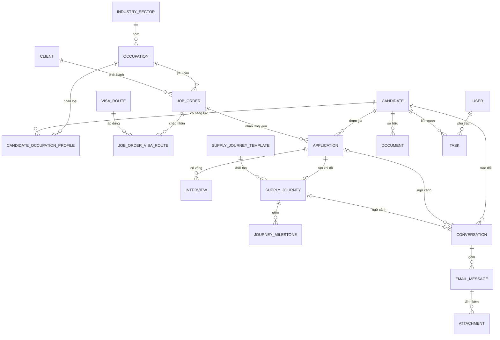

# 04. Mô hình dữ liệu

## 1. Mô hình quan hệ cốt lõi

## 2. Các thực thể chính

### 2.1 Candidate

| Nhóm trường | Ví dụ |
|---|---|
| Định danh | `id`, `candidate_code`, `full_name`, `date_of_birth` |
| Liên hệ | `primary_email`, `primary_phone`, danh sách liên hệ phụ |
| Năng lực chung | tiếng Nhật, nơi cư trú hiện tại, tình trạng lưu trú, địa điểm mong muốn |
| Hồ sơ nghề | một hoặc nhiều `CandidateOccupationProfile`: ngành/nghề, kinh nghiệm, kỹ năng, chứng chỉ, mức xác minh |
| Quản trị | `owner_user_id`, `team_id`, nguồn, `record_status`, `readiness_status`, `contactability_status`, tags |
| Nhạy cảm | hộ chiếu, quốc gia cấp, địa chỉ, giấy tờ cá nhân — tách/mask theo quyền |
| Hệ thống | `version`, `created_at`, `updated_at`, `archived_at` |

`candidate_code` là mã nghiệp vụ ổn định để trao đổi nội bộ; không dùng email làm khóa chính vì email có thể thay đổi.

`CandidateOccupationProfile` nối Candidate với `Occupation`, giữ số năm kinh nghiệm, mô tả kỹ năng, mức phù hợp, trạng thái xác minh và version. Chứng chỉ/tài liệu dùng thực thể riêng để hỗ trợ hạn hiệu lực và tái sử dụng. Thuộc tính đặc thù như tech stack của IT hoặc chứng chỉ ngành khác được validate theo `IndustryFieldDefinition` có version; không thêm cột rời vào Candidate cho từng ngành.

### 2.2 Danh mục ngành, nghề và tuyến visa

- `IndustrySector`: nhóm ngành cấp cao, code ổn định, tên Việt/Nhật, trạng thái hoạt động.
- `Occupation`: nghề/vị trí thuộc ngành, code ổn định, tên Việt/Nhật và version bộ trường/chứng chỉ áp dụng.
- `VisaRoute`: tuyến visa/tư cách lưu trú, điều kiện nơi cư trú và trạng thái hoạt động.
- `IndustryFieldDefinition`: định nghĩa trường chuyên ngành, kiểu dữ liệu, lựa chọn, validation và version; thay đổi không viết lại snapshot lịch sử.
- IT là một `IndustrySector`/nhóm `Occupation` trong catalog, có thể khai báo tech stack, portfolio và chứng chỉ riêng.

### 2.3 Client và JobOrder

- `Client`: doanh nghiệp Nhật, mã khách hàng, địa chỉ, người phụ trách nội bộ.
- `ClientContact`: người liên hệ, chức danh, email/điện thoại.
- `JobOrder`: ngành, nghề/vị trí, số lượng, kỹ năng, N-level, các tuyến visa chấp nhận, điều kiện tuyển, địa điểm, lương tham chiếu, hạn tuyển, trạng thái và version yêu cầu.
- `JobOrderVisaRoute`: quan hệ nhiều-nhiều vì một đơn hàng có thể chấp nhận nhiều tuyến visa.

### 2.4 Application và Interview

- `attempt_no` là số lần ứng viên quay lại cùng một đơn hàng; unique `(candidate_id, job_order_id, attempt_no)`.
- Chỉ cho phép một lần ứng tuyển đang hoạt động trên cùng candidate/job order bằng partial unique index với điều kiện `closed_at IS NULL`.
- `Application` giữ trạng thái ứng tuyển, nguồn ghép, recruiter, ngày giới thiệu, kết quả và `requirement_snapshot` của JobOrder tại thời điểm tạo.
- `Interview` có `round_no`, `schedule_status`, thời gian/múi giờ, hình thức, người tham gia, feedback và `result`; unique `(application_id, round_no)`.
- `InterviewQuestionTemplate` có phạm vi chung/ngành/nghề; `InterviewQuestionSnapshot` giữ nội dung/version thực tế đã dùng trong từng vòng.
- `ApplicationStatusHistory` ghi append-only mọi lần chuyển trạng thái.

### 2.5 SupplyJourney — lộ trình cung ứng sang Nhật

- Một `Application` đã đỗ tạo tối đa một lộ trình hiệu lực.
- `SupplyJourneyTemplate` được version theo nơi cư trú, tuyến visa, trường hợp tuyển mới/chuyển việc và tùy chọn ngành/nghề; journey lưu template/version đã dùng.
- `JourneyMilestoneTemplate` định nghĩa thứ tự, khả năng chạy song song, checklist/tài liệu mặc định và điều kiện áp dụng.
- `JourneyMilestone` không chỉ giữ trạng thái tổng mà còn giữ dự kiến/thực tế, blocker và owner.
- Bộ mốc chuẩn có thể gồm xác nhận nhận việc, hợp đồng/hồ sơ, COE, visa/đổi tư cách, chuẩn bị trước xuất cảnh, kế hoạch xuất cảnh, đã sang Nhật, doanh nghiệp tiếp nhận và hoàn tất cung ứng; template chỉ sinh mốc áp dụng.
- Ngày/chặng bay, mã đặt chỗ hoặc tệp hành trình là trường/tài liệu tùy chọn của mốc kế hoạch xuất cảnh; không tạo thực thể hàng không riêng trong baseline.
- Tài liệu liên kết qua `DocumentLink` để một tệp có thể phục vụ một mốc mà không sao chép binary.

### 2.6 Email

- `Mailbox`: đúng một bản ghi hoạt động trong MVP, cấu hình hộp thư chung và adapter.
- `Conversation`: chuỗi trao đổi được ghép với candidate; application/journey là tùy chọn.
- `EmailMessage`: hướng gửi/nhận, Message-ID, provider ID, subject, body chuẩn hóa, trạng thái và timestamps.
- `Attachment`: metadata, object key, checksum, MIME, kích thước và scan status.
- `EmailMatchDecision`: bằng chứng ghép tự động/thủ công và confidence/rule.

## 3. Chống trùng ứng viên

### 3.1 Khóa chuẩn hóa

- Email: lowercase, trim; giữ nguyên giá trị gốc để hiển thị.
- Điện thoại: chuẩn hóa E.164 khi xác định được mã quốc gia.
- Hộ chiếu: uppercase, loại khoảng trắng/ký tự phân tách theo quy tắc đã duyệt.

### 3.2 Cấp độ xử lý

| Kết quả | Hành động |
|---|---|
| Khớp chắc chắn một hồ sơ | Cảnh báo và mở hồ sơ hiện có |
| Khớp nhiều tín hiệu nhưng còn mơ hồ | Tạo `DuplicateReviewCase` |
| Không khớp | Cho phép tạo hồ sơ mới |

Hợp nhất hồ sơ phải là thao tác có quyền riêng, cho xem trước trường thắng/thua, giữ alias ID và ghi audit. Không xóa nguồn sau merge.

## 4. Index tối thiểu

| Bảng | Index đề xuất |
|---|---|
| Candidate | normalized email/phone; passport search hash; owner; readiness/contactability; updated_at |
| Application | candidate_id; job_order_id + status; recruiter + status |
| Interview | scheduled_at; application_id + round_no |
| JourneyMilestone | owner + due_at + status; journey_id |
| EmailMessage | unique `(provider, mailbox_id, provider_message_id)`; internet_message_id; conversation_id + sent_at |
| Task | assignee + status + due_at |
| AuditEvent | entity_type + entity_id + occurred_at; actor + occurred_at |

Tìm kiếm tên/kỹ năng có thể bắt đầu bằng PostgreSQL full-text/trigram. Chỉ thêm search engine riêng khi đo được PostgreSQL không đáp ứng.

## 5. Chính sách dữ liệu

- Timestamps lưu UTC, giao diện hiển thị theo múi giờ cấu hình.
- Dữ liệu nghiệp vụ dùng soft archive, không hard delete qua CMS.
- Số hộ chiếu lưu dạng ciphertext; tìm trùng bằng HMAC blind index của `issuing_country + normalized_passport`. Không index hoặc log giá trị hộ chiếu rõ.
- PII nhạy cảm mã hóa/mask theo trường và không ghi vào application log.
- Attachment lưu object storage; DB chỉ giữ metadata và checksum.
- Audit và status history append-only, có retention riêng được pháp chế/quản lý duyệt.
- Soft archive phục vụ nghiệp vụ và không đồng nghĩa giữ dữ liệu vô thời hạn. Quy trình purge theo retention phải xóa/ẩn danh dữ liệu đủ điều kiện, đồng thời tôn trọng legal hold và để lại bằng chứng purge không chứa PII.

Chi tiết trường, enum, ràng buộc và index là hợp đồng tại [11-tu-dien-du-lieu.md](./11-tu-dien-du-lieu.md).
