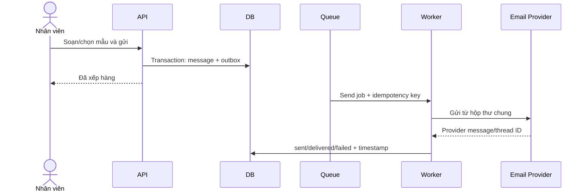
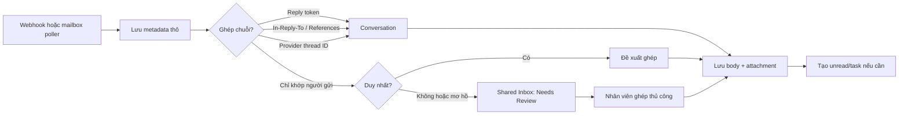

# 05. Email Hub và lưu vết phản hồi

## 1. Mục tiêu

Email Hub biến hộp thư chung thành một phần của hồ sơ ứng viên: nhân viên gửi đúng danh tính doanh nghiệp, nhận phản hồi tự động, lưu toàn bộ lịch sử và xử lý ngoại lệ có kiểm soát.

## 2. Baseline một hộp thư chung

MVP kết nối đúng **một hộp thư chung chính danh**, ví dụ `ungvien@company.vn` (địa chỉ thực tế cần được duyệt). Tất cả email gửi cho ứng viên đi từ địa chỉ này; chữ ký hiển thị tên nhân viên/đội đang xử lý để ứng viên biết đầu mối.

- Reply quay lại cùng hộp thư và được đồng bộ vào CMS.
- Quyền đọc/gửi áp dụng theo phạm vi candidate/application/supply journey, không chia mailbox giả tạo theo phòng ban.
- Mọi thao tác gửi vẫn lưu actor nội bộ dù địa chỉ `From` là hộp thư chung.
- Hỗ trợ nhiều mailbox chỉ là khả năng mở rộng tương lai; chỉ kích hoạt khi có nhu cầu tách thương hiệu, pháp nhân, lưu lượng hoặc quyền truy cập đã được chứng minh.

Provider có thể là Microsoft 365, Google Workspace hoặc SMTP/IMAP doanh nghiệp. Adapter phải giữ cùng một hợp đồng nghiệp vụ để không khóa hệ thống vào nhà cung cấp.

### Điều kiện email chính danh trước go-live

- Miền gửi và hộp thư phải được chủ sở hữu DNS/tenant xác minh; SPF khai báo đúng nhà cung cấp gửi thực tế, DKIM được bật ký và DMARC đạt alignment cho luồng gửi production.
- `From` phải là hộp thư chung hoặc alias đã được phê duyệt. `Reply-To` phải quay về hộp thư chung/alias đã xác minh để phản hồi đi vào CMS; không giả mạo địa chỉ hiển thị của miền chưa xác minh.
- Envelope sender/bounce address và webhook hoặc poller phải cho phép ghi nhận delayed bounce. Provider acceptance không được trình bày như bằng chứng delivered.
- IT/Security lưu owner của DNS/tenant, bằng chứng cấu hình, kết quả gửi thử có SPF/DKIM/DMARC pass và lịch kiểm tra lại. Thay provider, miền hoặc alias phải chạy lại gate này.
- Chính sách DMARC cuối cùng và lộ trình nâng mức bảo vệ phải do chủ sở hữu miền phê duyệt dựa trên toàn bộ nguồn gửi hợp lệ; CMS không tự sửa DNS.

## 3. Luồng gửi đi

### Quy tắc gửi

- Không giữ request HTTP chờ provider gửi xong.
- Mỗi message có idempotency key; retry không tạo email thứ hai.
- `outbox` trong PostgreSQL là nguồn sự thật. Dispatcher định kỳ quét bản ghi `PENDING`; BullMQ có thể được tái tạo nếu mất job.
- Template có phiên bản; message lưu snapshot nội dung đã gửi.
- Trạng thái tối thiểu: `draft`, `queued`, `sent`, `delivered`, `bounced`, `failed`.
- `opened` nếu có chỉ là tín hiệu tham khảo, không phải bằng chứng chắc chắn.

## 4. Luồng nhận phản hồi

Thứ tự bằng chứng ghép ưu tiên:

1. Reply token do CMS sinh.
2. `In-Reply-To` / `References` trỏ đến Message-ID đã lưu.
3. Provider thread/conversation ID.
4. Email người gửi là tín hiệu hỗ trợ, không đủ để tự đoán khi có nhiều hồ sơ/luồng.

Ingest dùng khóa duy nhất `(provider, mailbox_id, provider_message_id)` để webhook trùng hoặc poll lại không tạo message thứ hai. Poller lưu cursor/watermark và có chế độ catch-up khi webhook gián đoạn hoặc token/subscription được gia hạn.

## 5. Tệp đính kèm

1. Nhận metadata và stream vào vùng quarantine.
2. Kiểm tra kích thước, MIME thực, checksum và phần mở rộng.
3. Quét malware.
4. Nếu an toàn, chuyển sang bucket riêng tư và cập nhật `SAFE`.
5. Nếu nghi ngờ, giữ `QUARANTINED`, cấm preview/download trừ người có quyền xử lý.

Tệp được tải qua signed URL ngắn hạn; thao tác xem/tải tài liệu nhạy cảm có audit.

## 6. Shared Inbox

Các hàng đợi chính:

| View | Nội dung | Hành động |
|---|---|---|
| Needs Review | Không ghép được hoặc ghép mơ hồ | Gắn candidate/application/journey |
| Failed/Bounced | Gửi lỗi hoặc bị trả lại | Sửa địa chỉ, retry có kiểm soát |
| Unread Replies | Phản hồi chưa xử lý | Đọc, giao việc, đánh dấu hoàn tất |
| Quarantined Files | Tệp chưa an toàn | Xem metadata, xử lý theo quy trình |

## 7. Quy tắc nghiệp vụ quan trọng

- Email đến **không tự động** chuyển trạng thái phỏng vấn, đỗ/trượt, COE hoặc visa.
- Hệ thống có thể đề xuất tác vụ hoặc trích tín hiệu, nhưng nhân viên phải xác nhận.
- Chuyển tiếp nội bộ không được tạo ứng viên mới nếu không có đủ dữ liệu.
- Địa chỉ ứng viên thay đổi phải được xác nhận và lưu lịch sử.
- Retry bị giới hạn; quá số lần đưa vào DLQ và cảnh báo.
- Tự động trả lời/out-of-office, mailer-daemon và email do chính hộp thư gửi phải được nhận diện để tránh vòng lặp gửi tự động.
- HTML email phải được sanitize trước khi hiển thị; chặn script, remote tracking mặc định và liên kết nguy hiểm. Plain text là fallback bắt buộc.
- Hỗ trợ MIME/charset phổ biến, inline image/CID, forward, CC/BCC và delayed bounce mà không làm mất raw headers cần cho đối soát.
- Token OAuth/subscription sắp hết hạn, sync lag và poller cursor đứng yên phải có cảnh báo và runbook.

## 8. Audit email

Ghi tối thiểu các sự kiện: soạn, gửi, provider chấp nhận, delivered/bounced/failed, retry, nhận, mở trong CMS, tải tệp, ghép tự động, đổi ghép thủ công và truy cập nội dung nhạy cảm.

Danh sách sự kiện nghiệp vụ nào được gửi, mức tự động hóa và người duyệt nằm tại [12-ma-tran-email-thong-bao.md](./12-ma-tran-email-thong-bao.md).
