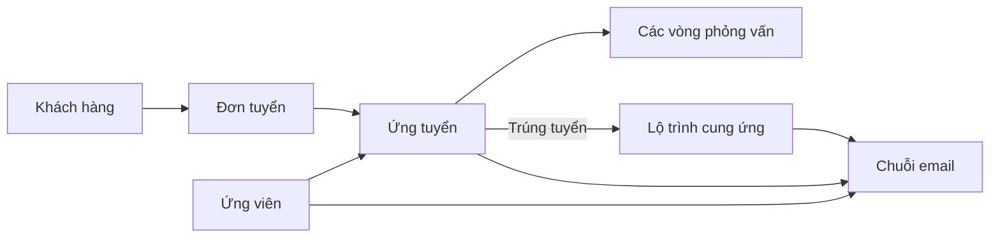

# 07. Thiết kế CMS và trải nghiệm người dùng

## 1. Trạng thái tài liệu

Tài liệu này là điểm vào của bộ thiết kế UI/UX đã được duyệt cho CMS nội bộ. Chi tiết được tách thành các chương nhỏ để đội sản phẩm, thiết kế, frontend, backend và kiểm thử có thể cùng truy vết.

Hướng thiết kế đã chốt:

- người dùng chính là nhân viên Kinh doanh/Tuyển dụng nội bộ;
- action-first và list-first, ưu tiên công việc cần xử lý hơn dashboard trang trí;
- một hồ sơ Candidate gốc, các danh sách nghiệp vụ là saved view;
- desktop-first, thao tác được trên tablet;
- phong cách CMS doanh nghiệp trung tính, gần trắng, chữ than và xanh dương tiết chế;
- chữ truyền đạt nghiệp vụ, icon chỉ hỗ trợ nhận biết thao tác;
- không dùng máy bay, cờ Nhật, emoji hoặc biểu tượng trang trí làm ngôn ngữ sản phẩm.

## 2. Bộ chương UI/UX

| Mã | Tài liệu | Phạm vi |
|---:|---|---|
| UX-00 | [Tổng quan thiết kế](./ui-ux/00-index.md) | Mục tiêu, nguyên tắc, bản đồ màn hình và nguồn sự thật |
| UX-01 | [Khung CMS](./ui-ux/01-khung-cms.md) | App shell, điều hướng, tìm kiếm, drawer, responsive và trạng thái chung |
| UX-02 | [Việc của tôi, khách hàng và đơn tuyển](./ui-ux/02-viec-khach-hang-don-tuyen.md) | Hàng đợi công việc và ngữ cảnh kinh doanh |
| UX-03 | [Ứng viên, ứng tuyển và phỏng vấn](./ui-ux/03-ung-vien-ung-tuyen-phong-van.md) | Candidate 360, saved view, pipeline và nhiều vòng phỏng vấn |
| UX-04 | [Lộ trình cung ứng](./ui-ux/04-lo-trinh-cung-ung.md) | Journey Template, milestone, hồ sơ và tiến độ cung ứng sang Nhật |
| UX-05 | [Hộp thư chung](./ui-ux/05-hop-thu-chung.md) | Shared Inbox, soạn/gửi, reply matching, tệp và audit |
| UX-06 | [Báo cáo và quản trị](./ui-ux/06-bao-cao-quan-tri.md) | Báo cáo vận hành, người dùng, quyền, danh mục và cấu hình |
| UX-07 | [Hệ thống giao diện và chất lượng](./ui-ux/07-he-thong-giao-dien-va-chat-luong.md) | Token, component, icon, form, accessibility và tiêu chí nghiệm thu |

## 3. Kiến trúc thông tin

Thanh điều hướng chính có tám khu vực:

1. **Việc của tôi**
2. **Khách hàng**
3. **Đơn tuyển**
4. **Ứng viên**
5. **Ứng tuyển & Phỏng vấn**
6. **Lộ trình cung ứng**
7. **Hộp thư chung**
8. **Báo cáo**

`Quản trị` nằm trong menu người dùng và chỉ xuất hiện khi có quyền. Ứng viên không có tài khoản hoặc portal.

## 4. Quan hệ nghiệp vụ chi phối giao diện

Các màn hình không được làm mờ ranh giới giữa Candidate, Application, Interview và SupplyJourney. Một ứng viên có thể tham gia nhiều đơn tuyển nhưng chỉ có tối đa một lộ trình cung ứng đang hoạt động.

## 5. Quy tắc dùng tài liệu

- Chương UI/UX mô tả hành vi quan sát được và tiêu chí nghiệm thu giao diện.
- [Từ điển dữ liệu](./11-tu-dien-du-lieu.md) là nguồn sự thật cho tên trường và enum kỹ thuật.
- [Hợp đồng chức năng](./13-hop-dong-chuc-nang.md) là nguồn sự thật cho action, API, guard và lỗi.
- [Phân quyền và bảo mật](./06-phan-quyen-bao-mat.md) là nguồn sự thật cho quyền và dữ liệu nhạy cảm.
- Nếu mockup và tài liệu mâu thuẫn, không tự suy diễn; phải cập nhật quyết định và truy vết trước khi triển khai.
