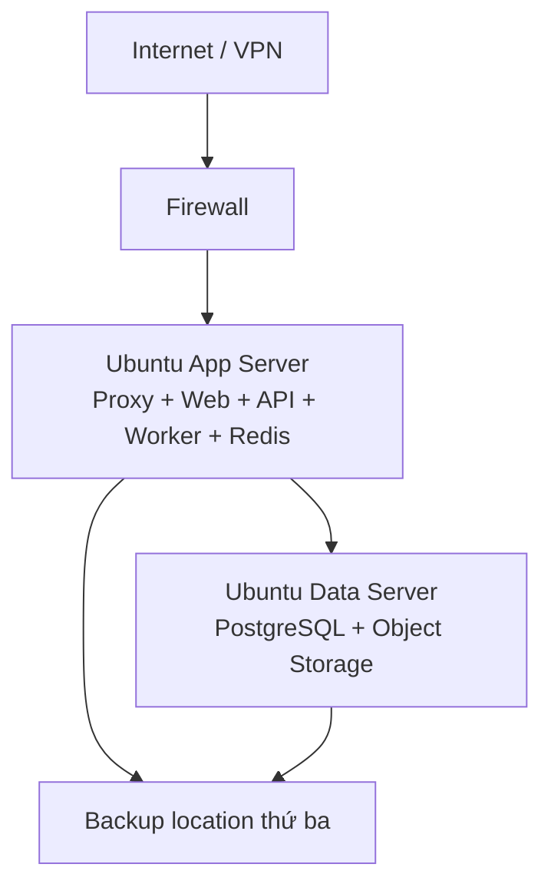

# 08. Vận hành trên Ubuntu Server

## 1. Topology khuyến nghị

### Phương án chuẩn cho quy mô trung bình

- Máy ứng dụng và máy dữ liệu nằm trong private network.
- Chỉ reverse proxy mở 80/443; 80 chỉ redirect sang 443.
- PostgreSQL, Redis và object storage không public Internet.
- Backup phải nằm ngoài cả hai máy, tốt nhất khác failure domain.

### Phương án một máy chủ

Có thể dùng khi ngân sách ban đầu hạn chế, nhưng phải chấp nhận single point of failure. Vẫn cần backup ngoài máy, giới hạn tài nguyên từng container và kế hoạch tách data server khi tải tăng.

## 2. Mô hình sizing trước khi mua máy

Không chọn CPU/RAM/disk chỉ từ “100.000 ứng viên, 200 tài khoản”. Tải và dung lượng phải được ước lượng từ các hệ số thực tế:

| Biến tải | Cách đo/ước lượng |
|---|---|
| Người dùng đồng thời | P50/P95 trong giờ cao điểm, không dùng tổng số tài khoản |
| Hồ sơ nghiệp vụ | candidate × application/candidate × interview/application × milestone/journey |
| Email | candidate hoạt động × message/candidate/năm × retention |
| Tệp | attachment/message × dung lượng P50/P95 × version/retention |
| Job nền | burst email, import rows/batch, scan backlog và report schedule |
| Database | dữ liệu + index + WAL/PITR + headroom tăng trưởng |
| Object storage | binary hiện tại + versioning + quarantine + backup/replication |

Trước go-live phải lấy mẫu từ dữ liệu cũ, tạo dataset gần production và đo latency/throughput. Giữ tối thiểu headroom đã được đội vận hành duyệt; không dùng con số cấu hình máy trong tài liệu này như cam kết capacity khi chưa load test.

Ưu tiên mở rộng theo thứ tự: tối ưu query/index → tăng tài nguyên → tách Worker/object storage → thêm API instance → nâng HA database. Email và attachment thường quyết định dung lượng/IO nhanh hơn số candidate.

## 3. Bố trí dịch vụ Docker Compose

| Service | Public | Persistent volume | Ghi chú |
|---|---:|---:|---|
| reverse-proxy | 80/443 | TLS/config | Rate limit, security headers |
| web | Không | Không | Internal network |
| api | Không | Không | Health/readiness endpoint |
| worker | Không | Không | Có thể scale instance độc lập |
| scheduler | Không | Không | Một active instance hoặc distributed lock |
| postgres | Không | Có | Disk riêng, backup/PITR |
| redis | Không | Tùy chính sách | Queue durability, memory limit |
| object-storage | Không | Có | Private bucket, versioning |

Không lưu dữ liệu quan trọng trong writable layer của container.

## 4. Hardening máy chủ

- Ubuntu Server LTS được cập nhật bảo mật định kỳ.
- SSH key, cấm root login và password authentication trên production.
- VPN hoặc IP allowlist cho SSH và CMS nếu chính sách cho phép.
- UFW/security group chỉ mở cổng cần thiết.
- Secrets không commit; mount qua secret file hoặc secret manager phù hợp.
- Container chạy non-root khi có thể, read-only filesystem cho service không cần ghi.
- Tách volume OS, PostgreSQL, object storage và log để tránh đầy disk dây chuyền.
- Log rotation và cảnh báo dung lượng ở các ngưỡng đã duyệt.

## 5. Sao lưu và khôi phục

### Mục tiêu đề xuất

- RPO: không quá 15 phút.
- RTO: không quá 4 giờ.

Đây là baseline cần duyệt theo ngân sách và yêu cầu kinh doanh.

### Thành phần backup

| Dữ liệu | Cơ chế |
|---|---|
| PostgreSQL | Base backup + WAL/PITR, backup mã hóa |
| Object storage | Versioning/replication hoặc incremental backup |
| Cấu hình | Compose, proxy, migration và runbook trong source control |
| Secrets | Backup an toàn theo secret manager, tách khỏi source |

Restore test tối thiểu theo lịch phải khôi phục cả DB và tệp, sau đó kiểm tra liên kết attachment bằng checksum. Một file backup tồn tại chưa phải bằng chứng có thể khôi phục.

## 6. Quan sát và cảnh báo

- API error rate, latency P50/P95/P99 và saturation.
- PostgreSQL connections, slow query, locks, disk và replication/PITR lag.
- Queue depth, tuổi job lâu nhất, retry, DLQ.
- Email sync delay, bounce/failure rate, webhook/poller health; tỷ lệ SPF/DKIM/DMARC pass/alignment và thay đổi bất thường về deliverability theo dữ liệu provider/report sẵn có.
- Object storage capacity, scan backlog và lỗi signed URL.
- CPU, RAM, disk inode, TLS expiry và backup freshness.

Mỗi cảnh báo cần có severity, owner và runbook; tránh cảnh báo không có người xử lý.

## 7. Quy trình phát hành

1. CI chạy lint, type-check, unit/integration tests và build image bất biến.
2. Deploy staging với migration rehearsal và dữ liệu giả lập đã ẩn danh.
3. Tạo/kiểm tra backup trước migration production.
4. Chạy migration backward-compatible.
5. Deploy API/Web/Worker theo thứ tự tương thích.
6. Smoke test: đăng nhập, tìm candidate, mở application, queue email đến hộp thử nghiệm kiểm soát, kiểm tra worker, SPF/DKIM/DMARC, reply ingest và bounce path.
7. Theo dõi metrics/log và rollback image khi gate không đạt.

Migration phá vỡ tương thích dùng chiến lược expand → migrate/backfill → contract qua nhiều lần phát hành.

## 8. Runbook sự cố tối thiểu

- API down hoặc health check fail.
- PostgreSQL hết kết nối/disk/slow lock.
- Queue tăng không giảm hoặc worker crash loop.
- Mailbox sync dừng, token hết hạn, provider rate limit.
- Email gửi trùng/bounce tăng đột biến.
- Email authentication/alignment thất bại do thay đổi DNS, DKIM key, provider, miền hoặc alias gửi.
- Object storage đầy hoặc attachment scan backlog.
- Khôi phục point-in-time và đối soát tệp.
- Thu hồi tài khoản/secret khẩn cấp.
