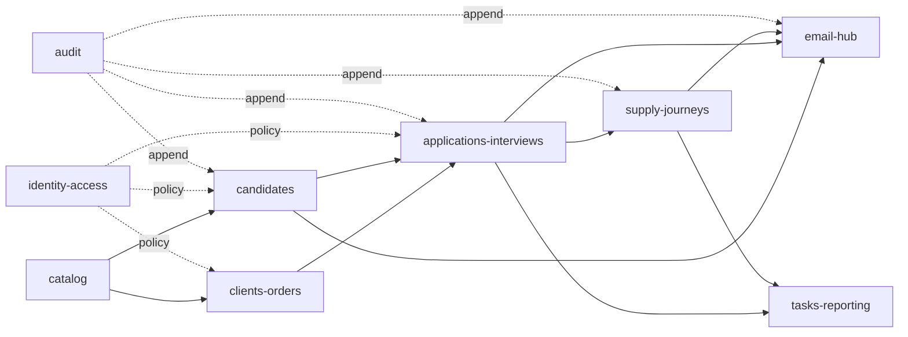

# 02. Kiến trúc và runtime

## 1. Technology baseline

| Component | Baseline |
|---|---|
| Runtime | Node.js `>=22.15`, ESM |
| Framework | NestJS 11 |
| ORM | Prisma ORM 7 + `@prisma/adapter-pg` |
| Database | PostgreSQL 17 |
| Queue | BullMQ + Redis, AOF và `maxmemory-policy=noeviction` |
| Object storage | S3-compatible private bucket |
| Validation | Nest ValidationPipe + class-validator hoặc Zod adapter chọn một lần ở Phase 0 |
| API contract | OpenAPI 3.1 + generated TypeScript client |
| Tests | Vitest/Jest-compatible Nest test harness, Testcontainers, Playwright consumer E2E |
| Packaging | Docker Compose, immutable images |

Dependency được pin qua `pnpm-lock.yaml`; không dùng floating `latest` trong Docker image hoặc release manifest.

## 2. Target directory

```text
apps/api/
├── package.json
├── nest-cli.json
├── tsconfig.json
├── Dockerfile
├── prisma/
│   ├── schema.prisma
│   ├── migrations/
│   └── seed/
├── src/
│   ├── bootstrap/
│   │   ├── api.ts
│   │   ├── worker.ts
│   │   └── scheduler.ts
│   ├── app.module.ts
│   ├── config/
│   ├── database/
│   ├── common/
│   │   ├── auth/
│   │   ├── errors/
│   │   ├── http/
│   │   ├── idempotency/
│   │   ├── observability/
│   │   └── validation/
│   └── modules/
│       ├── identity-access/
│       ├── catalog/
│       ├── clients-orders/
│       ├── candidates/
│       ├── applications-interviews/
│       ├── supply-journeys/
│       ├── email-hub/
│       ├── tasks-reporting/
│       └── audit/
└── test/
    ├── contract/
    ├── integration/
    ├── security/
    └── performance/
```

## 3. Module internal layout

```text
<module>/
├── domain/           # entities/value objects/pure policies
├── application/      # commands, queries, ports, transaction orchestration
├── infrastructure/   # Prisma repository, provider adapter, queue producer
├── http/             # controller, DTO mapping, OpenAPI decorators
├── jobs/             # processor/scheduled handler owned by module
├── <module>.module.ts
└── architecture.test.ts
```

Domain không import NestJS, Prisma, BullMQ hoặc provider SDK. Application layer chỉ phụ thuộc ports. Infrastructure implement ports. Controller không chứa business rule.

## 4. Public module interfaces

Mỗi module export tối đa:

- application service/query interface;
- domain ID/value types ổn định;
- integration event schema nếu cần;
- Nest module registration.

Không export Prisma model/client/repository. Module khác không query bảng nội bộ trực tiếp. Report query được phép dùng read model/SQL view được owner công bố, không dùng write repository xuyên module.

## 5. Dependency direction



Dependency cycle làm architecture test fail.

## 6. Process bootstrap

### API

- Global prefix `/api/v1`.
- Request ID trước logging/tracing.
- Helmet/security headers, strict CORS allowlist.
- Cookie parser, session, CSRF, authentication, authorization.
- Validation whitelist và exception filter chuẩn.
- Graceful shutdown; readiness false trước khi đóng connection.

### Worker

- Chỉ load job processors và provider adapters cần thiết.
- Queue worker dùng connection riêng với retry behavior phù hợp worker.
- Handle SIGINT/SIGTERM, dừng nhận job mới và chờ grace period.
- Mọi processor idempotent và ghi JobAttempt.

### Scheduler

- PostgreSQL advisory lock theo job name.
- Job: outbox dispatch, mailbox poll, subscription renewal, reminder, aggregate refresh, retention dry-run.
- Không chạy destructive purge nếu `PURGE_ENABLED=false` hoặc thiếu approved policy version.

## 7. Transaction model

- Một command thay đổi aggregate và AuditEvent/Outbox liên quan trong cùng PostgreSQL transaction.
- Không giữ transaction khi gọi OIDC, email provider, S3 hoặc malware scanner.
- Provider call dùng persisted intent trước, result update sau.
- Cross-module synchronous command gọi application port trong cùng process và truyền transaction context khi cần.
- Eventual consistency chỉ dùng cho read model, email/file job và report aggregate; UI phải hiển thị trạng thái pending.

## 8. Idempotency

| Flow | Key |
|---|---|
| HTTP command do client retry | `Idempotency-Key + actor + operationId` |
| Email send | event/entity/templateVersion/recipient hoặc client key |
| Webhook ingest | provider/mailbox/providerMessageId |
| Import commit | fileChecksum/mappingVersion/owner |
| Export | job ID; retry tạo job mới có parent ID |
| Scheduled rule | rule/entity/dueBucket |

Key và canonical request hash được lưu. Cùng key khác payload trả `409 IDEMPOTENCY_CONFLICT`.

## 9. Configuration

Config được parse/validate khi process boot. Thiếu biến bắt buộc làm process fail trước listen.

Nhóm biến:

- runtime: `NODE_ENV`, `PORT`, `LOG_LEVEL`;
- database: `DATABASE_URL`, pool/timeouts;
- Redis/queue;
- OIDC issuer/client/redirect/session keys;
- S3 endpoint/bucket/KMS/signed URL TTL;
- email adapter credential references;
- observability endpoints;
- feature activation flags có decision record.

Không log giá trị config secret. `/admin/mailbox` chỉ trả `credentialConfigured`.

## 10. Health

| Endpoint | Semantics |
|---|---|
| `/health/live` | Process event loop hoạt động; không query dependency |
| `/health/ready` | DB reachable, migrations compatible; API không phụ thuộc mailbox để ready |
| Worker health metric | heartbeat, queue connection, oldest active job |
| Scheduler health metric | last successful lock/run per job |

Mailbox/S3 degradation xuất hiện trong admin/metrics và chỉ làm `ready=false` khi endpoint hiện tại không thể giữ contract an toàn.

## 11. Deployment compatibility

- Expand → deploy compatible code → backfill → enforce → contract.
- API version N và N-1 phải cùng chạy được trong rolling window đã định.
- Worker job payload có `schemaVersion`; worker cũ không nhận payload không hỗ trợ.
- Migration deploy là job riêng có lock; API không tự migrate.
- Rollback app không được yêu cầu rollback schema phá hủy.

## 12. Architecture tests

Test phải fail khi:

- domain import `@nestjs/*`, Prisma hoặc provider SDK;
- module import infrastructure/repository của module khác;
- controller import Prisma client;
- queue payload không có schema version;
- HTTP route không xuất hiện trong OpenAPI;
- error raw từ database/provider đi thẳng ra response.

## 13. External references

- [Prisma ORM system requirements](https://docs.prisma.io/docs/orm/reference/system-requirements) và [Prisma ORM overview](https://docs.prisma.io/docs/orm) xác nhận Node 22 được hỗ trợ và Prisma 7 dùng driver adapter cho kết nối trực tiếp PostgreSQL.
- [NestJS migration guide](https://docs.nestjs.com/migration-guide) xác nhận NestJS 11 yêu cầu Node 20 trở lên; repository này giữ baseline Node `>=22.15`.
- [BullMQ NestJS guide](https://docs.bullmq.io/guide/nestjs) và [BullMQ production guide](https://docs.bullmq.io/guide/going-to-production) là nguồn cho integration, Redis persistence, `noeviction` và graceful shutdown.

Các dependency major chỉ đổi qua ADR + compatibility branch, không đổi giữa một phase implementation.
