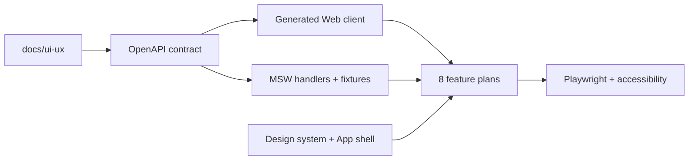

# Roadmap triển khai 8 khu vực UI/UX

## 1. Mục tiêu

Chuyển bộ đặc tả tại [docs/ui-ux](../ui-ux/00-index.md) thành frontend CMS chạy được, kiểm thử được và sẵn sàng nối NestJS API. Phạm vi roadmap này gồm Next.js Web, OpenAPI client, MSW mock server, design system, accessibility và E2E UI; chưa triển khai nghiệp vụ backend thật.

> **Trạng thái hiện tại:** Sprint 0–3 và Sprint 4 (Plan 08) đã có implementation frontend, mock contract và test/E2E tương ứng; Candidate list/drawer/360 cùng các form tạo/sửa/import/duplicate review đã hoàn thiện trên mock API. Các form thêm ứng viên vào đơn, quyết định ứng tuyển, khởi tạo lộ trình, miễn trừ mốc, liên kết email và xuất báo cáo đã được chuẩn hóa về primitive `Modal` dùng chung. MSW chỉ được bật ở development/test; production shell lấy phiên qua `GET /api/v1/me`. Backend nghiệp vụ thật, export worker và tích hợp mailbox thật vẫn là phần tiếp theo của roadmap.

## 2. Kiến trúc thực thi



Nguyên tắc:

- API contract đi trước service/UI; không định nghĩa DTO trùng lặp trong feature.
- UI gọi cùng endpoint `/api/v1` ở mock và production.
- MSW chỉ thay transport trong development/test, không chứa business rule quyết định.
- Server state dùng TanStack Query; URL giữ filter/sort/page/drawer context.
- React Hook Form + Zod dùng cho form; permission được kiểm ở UI để hướng dẫn nhưng API vẫn là lớp cưỡng chế.
- Vitest + Testing Library kiểm hành vi component; Playwright kiểm critical path; axe kiểm accessibility tự động.
- Không triển khai candidate portal, AI ranking, nhiều mailbox, CRM doanh thu hoặc flight module.

## 3. Thứ tự triển khai

| Sprint | Plan | Phụ thuộc | Exit gate |
|---|---|---|---|
| 0 | [01 — Nền tảng và App shell](./sprint-00/01-nen-tang-va-app-shell.md) | Không | Web chạy độc lập, token/component/table/drawer/permission/mock/test sẵn sàng |
| 1 | [02 — Việc của tôi](./sprint-01/02-viec-cua-toi.md) | Plan 01 | Queue công việc, KPI filter, drawer và action chạy bằng mock contract |
| 1 | [03 — Khách hàng và đơn tuyển](./sprint-01/03-khach-hang-va-don-tuyen.md) | Plan 01 | Client/Order list-detail và thêm Candidate vào đơn hoạt động |
| 2 | [04 — Ứng viên](./sprint-02/04-ung-vien.md) | Plan 01, 03 | Candidate list/drawer/360, duplicate/import shell và file states hoạt động |
| 2 | [05 — Ứng tuyển và phỏng vấn](./sprint-02/05-ung-tuyen-va-phong-van.md) | Plan 01, 03, 04 | Derived stage, interview timeline/form và pass→journey gate hoạt động |
| 3 | [06 — Lộ trình cung ứng](./sprint-03/06-lo-trinh-cung-ung.md) | Plan 01, 05 | Journey list/detail/milestone/evidence/waiver và optional departure hoạt động |
| 3 | [07 — Hộp thư chung](./sprint-03/07-hop-thu-chung.md) | Plan 01, 04, 05, 06 | Inbox/thread/composer/unmatched/quarantine và conflict states hoạt động |
| 4 | [08 — Báo cáo và quản trị](./sprint-04/08-bao-cao-va-quan-tri.md) | Plan 01–07 | KPI drill-down, export job và các màn hình quản trị cốt lõi hoạt động |

## 4. Route baseline

| Route | Khu vực |
|---|---|
| `/work` | Việc của tôi |
| `/clients`, `/clients/[clientId]` | Khách hàng |
| `/orders`, `/orders/[orderId]` | Đơn tuyển |
| `/candidates`, `/candidates/[candidateId]` | Ứng viên |
| `/applications`, `/applications/[applicationId]` | Ứng tuyển & Phỏng vấn |
| `/supply-journeys`, `/supply-journeys/[journeyId]` | Lộ trình cung ứng |
| `/mailbox`, `/mailbox/[conversationId]` | Hộp thư chung |
| `/reports` | Báo cáo |
| `/admin/users`, `/admin/catalogs`, `/admin/templates`, `/admin/mailbox`, `/admin/audit` | Quản trị theo quyền |

## 5. Nguồn sự thật và interface dùng chung

| Interface | Nguồn |
|---|---|
| API schema | `packages/contracts/openapi/cms.yaml` |
| Generated types/client | `packages/contracts/src/generated/` |
| API wrapper | `apps/web/src/lib/api/client.ts` |
| Auth/permission context | `apps/web/src/lib/auth/`, `apps/web/src/lib/permissions/` |
| Design tokens | `apps/web/src/app/globals.css` |
| UI primitives | `apps/web/src/components/ui/` |
| Layout primitives | `apps/web/src/components/layout/` |
| Mock transport | `apps/web/src/mocks/` |
| Feature code | `apps/web/src/features/{work,clients,orders,candidates,applications,journeys,mail,reports,admin}/` |
| Critical E2E | `tests/e2e/` |

## 6. Gate áp dụng cho mọi plan

- `pnpm lint`, `pnpm typecheck`, `pnpm test`, `pnpm build` đều đạt.
- E2E của feature đạt trên desktop và tablet viewport.
- Không có lỗi axe nghiêm trọng trên route chính.
- Loading, empty, no-results, permission, error và conflict có test.
- Filter/sort/page/drawer context giữ được trên URL.
- Không dùng màu/icon làm nguồn trạng thái duy nhất; không có emoji/cờ/máy bay trang trí.
- Primary action có nhãn chữ; icon-only có accessible name và tooltip.
- Fixture dùng dữ liệu giả, không chứa PII hoặc email ứng viên thật.
- Mỗi task chỉ commit sau khi test tương ứng xanh.

## 7. Interface registry dùng xuyên plan

Các plan không tự đổi tên hoặc hình dạng các interface sau. Nếu contract cần thay đổi, cập nhật registry, OpenAPI và mọi consumer trong cùng commit.

```ts
export type PageResult<T> = {
  items: T[];
  nextCursor?: string;
  total?: number;
};

export type ListParams = {
  query: string;
  view: string;
  sort: string;
  cursor?: string;
  selectedId?: string;
};

export type ApiProblem = {
  code: string;
  message: string;
  fieldErrors?: Record<string, string[]>;
  currentVersion?: number;
  traceId?: string;
};

export type EntityRef = {
  id: string;
  code: string;
  displayName: string;
};

export type Versioned = {
  version: number;
  updatedAt: string;
};

export type DataScope = 'SELF' | 'TEAM' | 'DEPARTMENT' | 'ALL';
```

URL list dùng các key `q`, `view`, `sort`, `cursor`, `selectedId`. Mutation trên record versioned luôn gửi `version`; `409 VERSION_CONFLICT` trả `currentVersion`.

## 8. Definition of Done toàn roadmap

1. Tám plan hoàn tất theo thứ tự phụ thuộc.
2. Navigation và permission hiển thị đúng tám khu vực cùng Admin theo quyền.
3. Mỗi route có MSW scenario thành công và ít nhất một failure/empty/permission scenario.
4. Critical path Candidate → Application → Interview → Passed → Journey và Email được Playwright kiểm xuyên màn hình.
5. Contract client được sinh lại trong CI và không có diff chưa commit.
6. Không có source hoặc test bị `.gitignore` loại nhầm; policy Git được chuyển khỏi allowlist tài liệu khi Sprint 0 bắt đầu.

## 9. Ma trận bao phủ đặc tả

| Đặc tả | Plan/Task thực thi |
|---|---|
| UX-00 — Người dùng, visual direction, invariants, out-of-scope | Plan 01 Global Constraints, Tasks 1–6; gate toàn roadmap |
| UX-01 — Shell, navigation, search, table, drawer, responsive, states | Plan 01 Tasks 3–6 |
| UX-02.A — Việc của tôi | Plan 02 Tasks 1–4 |
| UX-02.B/C — Khách hàng và đơn tuyển | Plan 03 Tasks 1–4 |
| UX-03.A — Candidate list/drawer/360/import/duplicate/files | Plan 04 Tasks 1–5 |
| UX-03.B — Application, nhiều vòng Interview, decision/Journey gate | Plan 05 Tasks 1–5 |
| UX-04 — Journey template/milestone/evidence/waiver/departure | Plan 06 Tasks 1–4 |
| UX-05 — Inbox/thread/composer/matcher/attachment/conflict | Plan 07 Tasks 1–5 |
| UX-06 — Reports/export/users/roles/catalog/template/mailbox/audit | Plan 08 Tasks 1–6 |
| UX-07 — Tokens, components, icon policy, form, accessibility, concurrency | Plan 01 Tasks 1–6 và Global Gate của mọi plan |

Kết quả tự rà: mọi chương UX-00–UX-07 có ít nhất một task thực thi và một gate kiểm thử; không chuyển backend domain implementation vào roadmap frontend này.
