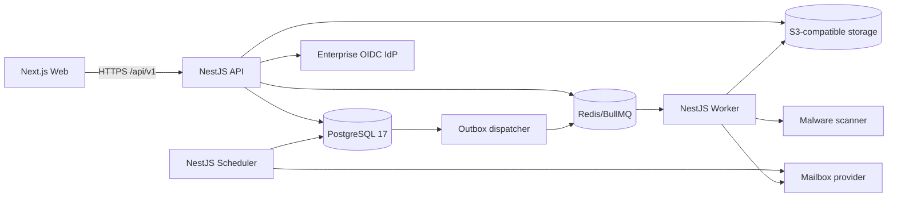

# Backend Production Handoff Design

## 1. Goal

Chuyển baseline sản phẩm và frontend/mock hiện tại thành một gói đặc tả backend có thể giao cho đội NestJS triển khai theo contract-first, test-first và fail-closed, không yêu cầu developer tự suy diễn nghiệp vụ, bảo mật hoặc cách vận hành production.

## 2. Success criteria

Gói bàn giao đạt yêu cầu khi:

1. Có một thứ tự nguồn sự thật duy nhất cho nghiệp vụ, dữ liệu, OpenAPI và UI.
2. Mọi module backend có boundary, interface, transaction và invariant rõ.
3. API có quy ước auth, envelope, error, pagination, concurrency và rate limit thống nhất.
4. Schema có khóa, quan hệ, partial index, retention hook và migration strategy.
5. Email, import, export, scan tệp và report nền có idempotency, retry và reconciliation.
6. Auth, PII, permission, migration và release đều có human approval gate.
7. Mỗi phase có implementation plan, test command, exit gate và rollback condition.
8. Quyết định chưa được business/legal/IT duyệt có hành vi fail-closed cụ thể; không có placeholder mơ hồ.

## 3. Scope

### In scope

- NestJS API, Worker và Scheduler trong một modular monolith.
- PostgreSQL 17, Prisma ORM 7 và raw SQL migration cho constraint nâng cao.
- Redis/BullMQ cho job nền; PostgreSQL outbox là nguồn sự thật cho side effect quan trọng.
- S3-compatible object storage, quarantine và malware scanning.
- OIDC SSO, session server-side, CSRF, permission theo action/scope/sensitivity.
- Catalog, Client, JobOrder, Candidate, Application, Interview, SupplyJourney, Email Hub, Task, Report, Admin và Audit.
- Contract, integration, E2E, security, performance, migration, backup và restore gates.

### Out of scope

- Candidate portal, payroll/HRM, CRM doanh thu/công nợ.
- Microservices, Kubernetes, multi-region active-active.
- AI tự quyết định ứng viên đạt/trượt hoặc tự chuyển trạng thái pháp lý.
- Nhiều mailbox production trong baseline.
- Data warehouse riêng và flight-management aggregate.

## 4. Chosen approach

### Recommended: contract-first modular monolith

Đội backend triển khai một codebase NestJS với bốn runtime artifact: API, Worker, Scheduler và migration job. Module sở hữu repository của mình; module khác gọi application service công khai. Cùng PostgreSQL được dùng cho transaction và reporting ban đầu, nhưng quyền truy cập bảng được kiểm soát bằng convention, test kiến trúc và review.

Ưu điểm:

- Giữ transaction Candidate/Application/Journey và outbox đơn giản.
- Phù hợp quy mô 100.000 ứng viên, khoảng 200 nhân viên nội bộ.
- Có thể tách Worker và object storage trước khi cần tách service.
- Giảm vận hành so với microservices nhưng vẫn có boundary rõ.

Chi phí:

- Cần architecture test để ngăn module truy cập repository của nhau.
- Prisma cần migration SQL thủ công cho partial unique index, trigger/constraint và append-only guard.
- Permission policy và field masking phải được dùng thống nhất ở mọi query path.

### Rejected: backend CRUD-first từ OpenAPI mock

Không dùng OpenAPI hiện tại để sinh controller CRUD trực tiếp vì contract mock đang lệch data dictionary, thiếu auth/security scheme, response envelope và nhiều command nghiệp vụ. Contract alignment là Task 0 trước domain implementation.

### Rejected: tách microservice theo module ngay từ đầu

Không có tải, ownership hoặc release cadence độc lập đủ để bù distributed transaction, network failure, tracing và chi phí vận hành.

## 5. Runtime architecture

API không chờ email provider, export, import hoặc malware scan. Worker không nhận traffic công khai. Scheduler chạy một logical leader bằng PostgreSQL advisory lock.

## 6. Source-of-truth order

1. ADR đã `Accepted` và tài liệu backend đã được human approver chuyển sang `approved`.
2. `docs/11-tu-dien-du-lieu.md` cho enum/invariant cốt lõi, trừ quyết định supersede được ghi rõ trong backend decision register.
3. `packages/contracts/openapi/cms.yaml` sau khi Contract Alignment Gate đạt.
4. Backend module specs và implementation plans.
5. UI/UX specs cho hành vi quan sát được.
6. Frontend backlog/MSW fixture chỉ là consumer/test double, không phải business rule.

Nếu hai nguồn cùng cấp mâu thuẫn, implementation dừng ở module liên quan, mở decision record và không chọn ngầm.

## 7. Fail-closed decisions

| Chủ đề chưa được duyệt | Hành vi code được phép | Hành vi production bị chặn |
|---|---|---|
| Permission matrix cuối | Xây policy engine và seed baseline ở non-production | Không activate role seed production |
| Email provider | Xây adapter contract, fake adapter và health model | Không bật gửi/nhận production |
| Retention | Xây policy engine, legal hold và purge dry-run | `PURGE_ENABLED=false` |
| Catalog/Journey Template | Xây versioning và import seed | Không activate template chưa duyệt |
| Privacy/chia sẻ sang Nhật | Xây approval/evidence fields và policy guard | Không xuất/chia sẻ nếu thiếu decision record |
| RPO/RTO/topology | Xây backup/restore scripts và test profile | Không ký release production |

## 8. Documentation package

Gói nguồn sự thật nằm tại `docs/backend/`:

- governance, source-of-truth và contract alignment;
- architecture/runtime, API/IAM và data/migration;
- domain specs cho tuyển dụng, journey, email và reporting/admin;
- security/privacy, operations/DR, testing/release;
- decision register, traceability và Definition of Done;
- năm implementation plan Phase 0–4.

## 9. Review and approval model

| Artifact | Reviewer bắt buộc | Approver |
|---|---|---|
| Domain/data/API | Backend Tech Lead, QA | Backend Tech Lead |
| Auth/permission/PII | Security, Backend Tech Lead | Security Owner |
| Workflow/evidence/KPI | Product Owner, đại diện nghiệp vụ | Product Owner |
| Email/DNS/provider | IT, Security, Business Owner | IT Owner |
| Migration/backup/release | DBA/DevOps, QA | Infrastructure Owner |

Codex không tự phê duyệt artifact high-risk. `ready_for_human_approval` nghĩa là nội dung đủ để review; chỉ người có trách nhiệm mới chuyển thành `approved`.

## 10. Delivery sequence

1. Contract Alignment Gate.
2. Phase 0: foundation, IAM, database, audit, observability và CI.
3. Phase 1A: catalog, client/order, candidate, application/interview, task.
4. Phase 1B: one-mailbox Email Hub.
5. Phase 2: Supply Journey, document/evidence và milestone automation.
6. Phase 3–4: reports, admin hardening, performance, DR, UAT và go-live.

Mỗi phase chỉ bắt đầu sau khi dependency contract và migration của phase trước đã được merge, deployed staging và có bằng chứng test.

## 11. Self-review

- Không có placeholder hoặc quyết định ngầm.
- Những giá trị cần business/legal quyết định đều có fail-closed behavior và owner trong decision register.
- Kiến trúc khớp ADR modular monolith, một mailbox, outbox và một active journey.
- Plan được tách theo subsystem để mỗi phase tạo phần mềm chạy và kiểm thử độc lập.
