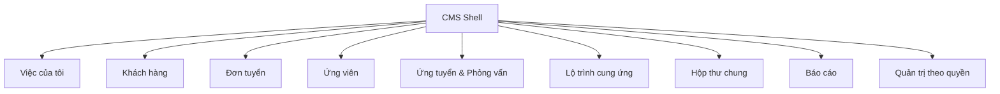

# UX-00. Tổng quan thiết kế CMS

## 1. Mục tiêu trải nghiệm

CMS giúp nhân viên nội bộ trả lời nhanh:

1. Việc nào cần xử lý trước?
2. Ứng viên đang ở đâu trong quá trình tuyển dụng và cung ứng?
3. Ai đang chịu trách nhiệm và hạn tiếp theo là khi nào?
4. Khách hàng, đơn tuyển và chỉ tiêu nào liên quan?
5. Email, phản hồi, tệp và bằng chứng đang nằm ở đâu?

Giao diện không cố biến nghiệp vụ thành dashboard nhiều thẻ hoặc một hệ thống theo dõi chuyến bay. Trọng tâm là danh sách, hồ sơ, hành động tiếp theo, thời hạn, trách nhiệm và lịch sử.

## 2. Người dùng và thiết bị

| Vai trò | Mục tiêu chính |
|---|---|
| Kinh doanh/Tuyển dụng | Tạo và làm giàu hồ sơ, ghép đơn, theo dõi phỏng vấn, email và công việc |
| Điều phối Nhật | Theo dõi hồ sơ, milestone, blocker và bàn giao sau trúng tuyển |
| Quản lý | Phân công, phê duyệt ngoại lệ, theo dõi SLA và kết quả đội |
| Quản trị viên | Quản lý tài khoản, quyền, danh mục và cấu hình; không mặc định đọc dữ liệu nghiệp vụ |

Thiết kế desktop-first cho hoạt động hằng ngày và phải giữ đủ thao tác cốt lõi trên tablet. Không có giao diện ứng viên.

## 3. Hướng thị giác đã chốt

- Nền gần trắng, bề mặt trung tính, chữ than đậm và xanh dương tiết chế.
- Mật độ thông tin vừa phải, bảng là thành phần chính.
- Một primary action rõ trên mỗi màn hình.
- Card chỉ dùng cho chỉ số tổng hợp hoặc nhóm nội dung thật sự độc lập.
- Không dùng hình máy bay, cờ Nhật hoặc motif quốc gia để trang trí.
- Không dùng emoji hay ký hiệu như `✈`, `★`, `✓`, `⚠` làm control.
- Trạng thái luôn có nhãn chữ; màu và icon chỉ là tín hiệu bổ sung.

## 4. Bản đồ màn hình

Mỗi khu vực dùng cấu trúc chung: tiêu đề, saved view, tìm kiếm/bộ lọc, bảng dữ liệu, lớp chi tiết theo ngữ cảnh và trang chi tiết khi cần.

## 5. Invariant trải nghiệm

- Danh sách “Tiềm năng”, “Chờ phỏng vấn”, “Đã phỏng vấn” và “Trúng tuyển” là saved view, không phải kho dữ liệu riêng.
- Click một dòng mở lớp chi tiết phù hợp với nghiệp vụ và không làm mất trạng thái danh sách; hồ sơ khách hàng mở trực tiếp large sheet, không qua drawer tóm tắt.
- Filter, sort, phân trang và bản ghi đang mở được phản ánh trên URL khi phù hợp.
- Trạng thái có nguồn sự thật rõ; UI không cho sửa trực tiếp giá trị tổng hợp.
- Hành động nhạy cảm phải hiển thị tác động, yêu cầu quyền và lưu audit.
- Email mơ hồ phải vào hàng chờ xử lý; không tự đổi trạng thái nghiệp vụ.
- Dữ liệu chuyến đi chỉ nằm trong mốc chuẩn bị xuất cảnh nếu mẫu lộ trình cần.

## 6. Phạm vi ngoài baseline

- Portal hoặc tài khoản ứng viên.
- CRM doanh thu, báo giá, công nợ và hợp đồng thương mại đầy đủ.
- HRM/payroll sau khi nhân sự được tiếp nhận.
- AI tự quyết định đỗ/trượt hoặc tự chuyển trạng thái quan trọng.
- Giao diện nhiều mailbox trong MVP.
- Bản đồ, theo dõi chuyến bay hoặc dashboard trang trí.

## 7. Quy ước đặc tả

Mỗi chương mô tả:

- mục tiêu người dùng;
- cấu trúc màn hình;
- dữ liệu và hành động quan sát được;
- trạng thái loading/empty/error/permission/conflict;
- quy tắc phân quyền và audit;
- tiêu chí nghiệm thu UI.
