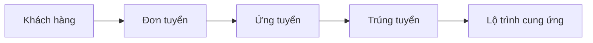

# UX-02. Việc của tôi, khách hàng và đơn tuyển

## 1. Quan hệ nghiệp vụ



Ứng viên là hồ sơ độc lập và không bị đơn tuyển sở hữu. Module khách hàng/đơn tuyển cung cấp ngữ cảnh cho tuyển dụng và cung ứng, không mở rộng thành CRM doanh thu/công nợ.

# A. Việc của tôi

## 2. Mục tiêu

Màn hình mặc định sau đăng nhập phải giúp nhân viên biết:

- việc nào đã quá hạn;
- việc nào cần làm hôm nay;
- hồ sơ nào đang chờ phản hồi;
- ai chịu trách nhiệm;
- bước nghiệp vụ tiếp theo là gì.

## 3. Hàng chỉ số ngắn

- Quá hạn.
- Phỏng vấn hôm nay.
- Chờ kết quả.
- Email chưa xử lý.
- Lộ trình có rủi ro.

Chỉ số hiển thị bằng số và nhãn chữ. Click chỉ số áp filter cho bảng phía dưới; không dùng card/icon nhiều màu.

## 4. Saved view

- `Cần xử lý` — mặc định.
- `Hôm nay`.
- `7 ngày tới`.
- `Quá hạn`.
- `Được giao cho tôi`.
- `Tôi đang theo dõi`.
- `Cả đội` — chỉ dành cho quản lý phù hợp.

## 5. Bảng công việc

| Cột | Nội dung |
|---|---|
| Ưu tiên | Khẩn cấp, Cao, Bình thường |
| Hạn xử lý | Ngày giờ và trạng thái quá hạn |
| Công việc | Hành động cụ thể cần thực hiện |
| Ứng viên | Mã và họ tên |
| Đơn tuyển | Mã đơn và vị trí |
| Khách hàng | Tổ chức liên quan |
| Trạng thái | Chưa làm, Đang xử lý, Chờ phản hồi |
| Phụ trách | Người chịu trách nhiệm |
| Hoạt động cuối | Thời gian cập nhật gần nhất |

Thứ tự mặc định: quá hạn, đến hạn hôm nay, SLA ngắn nhất, ưu tiên cao, sau đó theo thời gian.

## 6. Drawer công việc

Hiển thị lý do/nguồn tạo, hạn, owner, record liên quan, trạng thái, email hoặc hoạt động gần nhất, ghi chú nội bộ và lịch sử.

Hành động chính:

- `Đánh dấu hoàn thành`
- `Gửi email`
- `Đổi hạn xử lý`
- `Chuyển người phụ trách`
- `Mở hồ sơ đầy đủ`

## 7. Tự động tạo việc

Hệ thống có thể tạo/mở lại việc khi:

- có reply mới của ứng viên;
- quá hạn chờ ứng viên phản hồi;
- sắp đến lịch phỏng vấn;
- đã phỏng vấn nhưng chưa nhập kết quả;
- hồ sơ hoặc milestone thiếu tài liệu;
- milestone sắp quá hạn hoặc bị chặn;
- đơn tuyển sắp hết hạn nhưng chưa đủ chỉ tiêu.

Task tự động phải ghi nguồn, quy tắc, thời gian tạo và record liên quan. Email đến chỉ tạo tín hiệu/task, không tự quyết định trạng thái nghiệp vụ.

# B. Khách hàng

## 8. Loại tổ chức

- Doanh nghiệp tiếp nhận.
- Nghiệp đoàn hoặc tổ chức giám sát.
- Đối tác tuyển dụng.
- Đơn vị liên kết khác.

Loại tổ chức là catalog cấu hình, không hard-code.

## 9. Danh sách khách hàng

| Cột | Nội dung |
|---|---|
| Mã khách hàng | Mã nghiệp vụ duy nhất |
| Tên tổ chức | Tên pháp lý/tên sử dụng |
| Loại tổ chức | Theo catalog |
| Ngành nghề | Nhóm ngành liên quan |
| Phụ trách nội bộ | Nhân viên/đội owner |
| Đơn đang tuyển | Số đơn hiệu lực |
| Chỉ tiêu đang tuyển | Tổng nhu cầu hiện tại |
| Đã trúng tuyển | Kết quả theo application |
| Hoạt động cuối | Thời gian gần nhất |
| Trạng thái | Tiềm năng, Đang hợp tác, Tạm dừng, Ngừng hợp tác |

Khách hàng đã phát sinh lịch sử không được xóa vật lý.

## 10. Large sheet và trang chi tiết

Click một dòng khách hàng mở trực tiếp large sheet, không qua drawer tóm tắt. Sheet hiển thị thông tin tổ chức, khu vực tại Nhật, liên hệ chính, owner, đơn đang tuyển, chỉ tiêu/kết quả và hoạt động gần đây; đóng bằng vùng nền hoặc `Escape`.

Trang chi tiết có các tab:

1. Tổng quan.
2. Người liên hệ.
3. Đơn tuyển dụng.
4. Ứng viên và kết quả cung ứng.
5. Tệp và ghi chú.
6. Lịch sử thay đổi.

# C. Đơn tuyển

## 11. Danh sách đơn tuyển

| Cột | Nội dung |
|---|---|
| Mã đơn | Mã duy nhất |
| Vị trí | Tên công việc |
| Khách hàng | Doanh nghiệp tiếp nhận |
| Ngành nghề | IT, cơ khí, thực phẩm, điều dưỡng hoặc catalog khác |
| Địa điểm | Tỉnh/khu vực tại Nhật |
| Chỉ tiêu | Số người cần cung ứng |
| Đang xử lý | Số application còn hoạt động |
| Trúng tuyển | Số application đạt |
| Đã cung ứng | Số journey hoàn tất |
| Hạn tuyển | Thời hạn đơn |
| Phụ trách | Nhân viên/đội owner |
| Trạng thái | Nháp, Đang tuyển, Tạm dừng, Đủ chỉ tiêu, Đóng |

## 12. Vòng đời đơn tuyển

```text
Nháp → Đang tuyển → Tạm dừng → Đã đủ chỉ tiêu → Đóng
```

Khi đơn đạt đủ chỉ tiêu, nhân viên có thể chuyển từ `Đủ chỉ tiêu` sang `Đóng`; UI không yêu cầu nhập lại lý do vì hệ thống tự ghi nhận `TARGET_FILLED` vào audit. Hủy, thay thế hoặc đóng do ngoại lệ dùng action riêng có lý do bắt buộc.

## 13. Thông tin đơn tuyển

Nhóm chung:

- khách hàng và người liên hệ;
- vị trí, ngành và nhóm nghề;
- địa điểm làm việc;
- số lượng, hạn tuyển và owner;
- loại hợp đồng, lương và chế độ.

Tiêu chí ứng viên:

- trình độ tiếng Nhật;
- kinh nghiệm;
- kỹ năng/chứng chỉ;
- học vấn;
- điều kiện công việc;
- yêu cầu bổ sung.

Trường chuyên môn được cấu hình theo ngành; không xây form quanh kỹ năng IT. Điều kiện nhạy cảm không trở thành filter mặc định và phải tuân theo policy.

## 14. Trang chi tiết đơn

Click một dòng đơn tuyển mở trực tiếp large sheet hồ sơ, không cần nút trung gian `Mở hồ sơ đầy đủ`. Sheet giữ filter và `selectedId` trên URL, có thể đóng bằng vùng nền hoặc `Escape`; route `/orders/[orderId]` vẫn giữ cho truy cập trực tiếp hoặc nghiệp vụ dài.

1. Tổng quan.
2. Tiêu chí tuyển.
3. Ứng viên trong pipeline.
4. Kết quả phỏng vấn.
5. Tiến độ cung ứng.
6. Tệp và ghi chú.
7. Lịch sử thay đổi.

Primary action là `Thêm ứng viên vào đơn`.

## 15. Thêm ứng viên vào đơn

- Tìm trong kho ứng viên hiện có.
- Lọc theo ngành, nghề, kỹ năng, tiếng Nhật và trạng thái.
- Chọn nhiều hồ sơ khi có quyền.
- Kiểm tra trùng application trong cùng đơn.
- Cảnh báo lộ trình cung ứng khác đang hoạt động.
- Cho phép tạo Candidate mới khi không có hồ sơ phù hợp.
- Baseline dùng filter minh bạch và lựa chọn thủ công, chưa dùng AI ranking.

## 16. Cảnh báo sức khỏe đơn

Nhãn chữ: `Sắp hết hạn`, `Thiếu ứng viên`, `Chậm phỏng vấn`, `Chờ kết quả lâu`, `Đã đủ chỉ tiêu`, `Khách hàng tạm dừng`.

## 17. Phân quyền và audit

- Nhân viên cập nhật record được giao.
- Quản lý xem đội, phân công và điều chỉnh chỉ tiêu.
- Điều phối Nhật có quyền đọc phần cần cho journey.
- Admin quản lý catalog, không mặc định đọc dữ liệu nghiệp vụ.
- Thay đổi chỉ tiêu, hạn, tiêu chí, trạng thái và owner đều có audit.

## 18. Tiêu chí nghiệm thu

- “Việc của tôi” mặc định sắp đúng thứ tự ưu tiên và click KPI áp đúng filter.
- Task tự động giải thích được nguồn và không tự đổi kết quả nghiệp vụ.
- Client/Order list phân trang server-side và giữ view trên URL.
- Không tạo application trùng đang hoạt động trong cùng đơn.
- Đóng sau `Đủ chỉ tiêu` tự ghi audit `TARGET_FILLED`; hủy hoặc đóng do ngoại lệ yêu cầu lý do và lưu lịch sử.
- Mọi chỉ số order phân biệt application, người trúng tuyển và journey hoàn tất.
