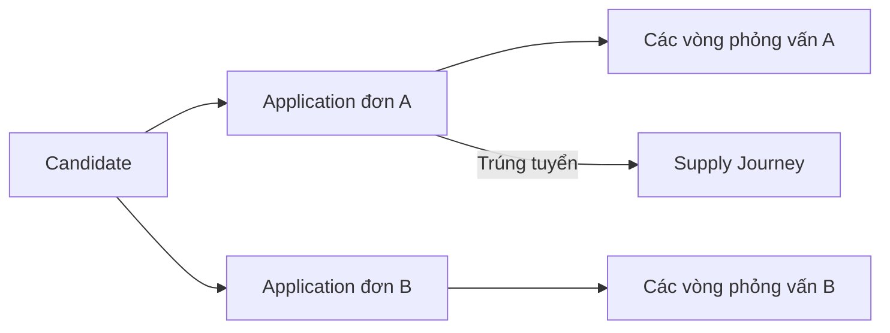

# UX-03. Ứng viên, ứng tuyển và phỏng vấn

## 1. Mô hình hiển thị

Chỉ có một hồ sơ Candidate gốc. “Tiềm năng”, “Chờ phỏng vấn”, “Đã phỏng vấn”, “Trúng tuyển” và “Đang cung ứng” là saved view từ các thực thể đúng.



# A. Ứng viên

## 2. Saved view ứng viên

- Tất cả ứng viên.
- Tiềm năng.
- Mới, chưa phân công.
- Sẵn sàng ghép đơn.
- Đang ứng tuyển.
- Đã trúng tuyển.
- Đang cung ứng.
- Thiếu hồ sơ.
- Tạm dừng.
- Lưu trữ.

## 3. Bảng ứng viên

| Cột | Nội dung |
|---|---|
| Mã ứng viên | Mã duy nhất |
| Họ và tên | Tên hiển thị |
| Liên hệ | Email và điện thoại theo quyền |
| Ngành nghề | Hồ sơ nghề chính |
| Tiếng Nhật | Cấp độ/kết quả đánh giá |
| Giai đoạn hiện tại | Giá trị tổng hợp từ nghiệp vụ |
| Việc tiếp theo | Task/mốc gần nhất |
| Phụ trách | Owner |
| Cập nhật cuối | Hoạt động gần nhất |

Người dùng có thể chọn thêm cột và lưu view. Filter hỗ trợ ngành/nghề, kỹ năng, chứng chỉ, tiếng Nhật, kinh nghiệm, địa điểm mong muốn, nguồn, owner, tình trạng hồ sơ, đơn đang tham gia và tài liệu thiếu.

## 4. Trạng thái và giai đoạn

UI phải tách ba lớp dữ liệu của Candidate:

- tình trạng lưu trữ: `Đang hoạt động`, `Lưu trữ` từ `record_status`;
- mức sẵn sàng: `Tiềm năng`, `Đã sàng lọc`, `Sẵn sàng ứng tuyển`, `Tạm dừng`, `Chưa phù hợp` từ `readiness_status`;
- khả năng liên hệ: `Có thể liên hệ`, `Tạm thời không liên hệ được`, `Không liên hệ` từ `contactability_status`.

Giai đoạn vận hành do hệ thống tổng hợp:

- `Tiềm năng`
- `Đang ứng tuyển`
- `Đã trúng tuyển`
- `Đang cung ứng`
- `Đã hoàn tất cung ứng`

UI không cho sửa trực tiếp giai đoạn tổng hợp. Thay đổi `record_status`, `readiness_status` và `contactability_status` dùng action riêng, reason/guard theo policy và không được làm mất lịch sử Application/Journey.

## 5. Drawer Candidate

Hiển thị mã/tên, liên hệ, ngành chính, tiếng Nhật, giai đoạn, owner, việc tiếp theo, đơn đang tham gia, email gần nhất, giấy tờ thiếu và hoạt động gần đây.

Hành động chính:

- `Gửi email`
- `Thêm vào đơn tuyển`
- `Tạo công việc`
- `Mở hồ sơ đầy đủ`

## 6. Candidate 360

| Tab | Nội dung |
|---|---|
| Tổng quan | Nhận dạng, liên hệ, nguồn, owner, kinh nghiệm, tiếng Nhật, ngành nghề, nguyện vọng và cảnh báo |
| Ứng tuyển | Toàn bộ đơn, khách hàng, trạng thái và kết quả |
| Lộ trình cung ứng | Journey đang hoạt động và lịch sử |
| Email | Chuỗi gửi/nhận và tệp liên quan |
| Tệp hồ sơ | CV, bằng cấp, chứng chỉ, giấy tờ cá nhân và tài liệu cung ứng |
| Công việc & ghi chú | Task và ghi chú nội bộ |
| Lịch sử | Actor, thời gian, trường cũ/mới và nguồn thay đổi |

Ghi chú nội bộ phải có nhãn rõ và không bao giờ được đưa vào email gửi ứng viên.

## 7. Hồ sơ đa ngành

Trường chung gồm kinh nghiệm, học vấn, tiếng Nhật, chứng chỉ, kỹ năng, nguyện vọng và khả năng bắt đầu. Field schema theo ngành có version, ví dụ:

- IT: vai trò, công nghệ, số năm kinh nghiệm, portfolio;
- cơ khí: loại máy, kỹ thuật gia công, chứng chỉ;
- điều dưỡng: chứng chỉ chuyên môn, kinh nghiệm chăm sóc;
- thực phẩm: dây chuyền, an toàn thực phẩm;
- xây dựng: nhóm nghề, chứng chỉ an toàn.

IT chỉ là một cấu hình, không phải schema mặc định của toàn hệ thống.

## 8. Tệp hồ sơ

Mỗi tệp hiển thị tên, loại, phiên bản, người/thời gian tải lên, trạng thái xác minh, trạng thái quét, phạm vi truy cập và lịch sử tải xuống. Tệp nhạy cảm chỉ hiện theo quyền.

## 9. Tạo, import và chống trùng

Nguồn tạo:

- form thủ công;
- import CSV/XLSX có preview và mapping;
- email nhận vào sau khi nhân viên xác nhận.

Tín hiệu trùng: email, điện thoại chuẩn hóa, mã giấy tờ theo quyền, họ tên + ngày sinh và similarity. Hệ thống không tự ghi đè hoặc merge. Merge cần quyền, lý do và giữ toàn bộ application, journey, email, tệp và audit.

# B. Ứng tuyển và phỏng vấn

## 10. Application

Mỗi Application nối một Candidate với một JobOrder và giữ owner, trạng thái, các vòng Interview, kết quả và lịch sử. Một candidate không có hai application đang hoạt động trong cùng một đơn.

## 11. Trạng thái lõi và stage hiển thị

Application chỉ lưu enum lõi:

```text
MATCHED → IN_INTERVIEW_PROCESS → PASSED / FAILED
              ↕
           ON_HOLD

MATCHED hoặc IN_INTERVIEW_PROCESS → WITHDRAWN
```

Các nhãn `Mới đưa vào đơn`, `Đang sơ tuyển`, `Chờ phỏng vấn`, `Đã lên lịch`, `Đã phỏng vấn` và `Chờ kết quả` là **stage/view vận hành được suy ra** từ Application cùng các Interview, không phải các enum Application mới.

Trạng thái kết thúc `FAILED`/`WITHDRAWN` cần reason code để phân biệt không đạt, ứng viên rút, khách hàng hủy hoặc đơn đóng. “Đã phỏng vấn” và “Chờ kết quả” được tách ở lớp view để nhìn thấy hồ sơ đã hoàn thành vòng nhưng chưa có quyết định.

## 12. Saved view và bảng ứng tuyển

View: Chờ sơ tuyển, Chờ phỏng vấn, Phỏng vấn hôm nay, Đã phỏng vấn, Chờ kết quả, Trúng tuyển, Không đạt/đã rút, Quá hạn xử lý.

Cột: ứng viên, đơn, khách hàng, vòng phỏng vấn, trạng thái, lịch phỏng vấn, số ngày ở trạng thái, việc tiếp theo, owner và cập nhật cuối.

Mặc định dùng bảng. Chế độ cột chỉ dùng trong phạm vi một đơn và tập dữ liệu nhỏ; không chuyển trạng thái quan trọng chỉ bằng drag-and-drop không xác nhận.

Click một dòng ứng tuyển mở trực tiếp large sheet hồ sơ với các tab tổng quan, vòng phỏng vấn, kết quả, tệp và lịch sử; không thêm drawer tóm tắt trung gian. Filter, view và `selectedId` được giữ trên URL khi sheet mở.

## 13. Interview

Một Application có nhiều vòng. Mỗi Interview gồm:

- số/tên vòng;
- ngày giờ và múi giờ;
- trực tiếp/trực tuyến;
- địa điểm hoặc liên kết;
- người tham gia;
- owner nội bộ;
- nội dung chuẩn bị;
- tệp;
- trạng thái.

Trạng thái: `Đã lên lịch`, `Đã xác nhận`, `Đã diễn ra`, `Đã đổi lịch`, `Ứng viên vắng mặt`, `Bị hủy`. Đổi lịch tạo lịch sử, không ghi đè thời gian cũ.

## 14. Kết quả phỏng vấn

- Kết quả vòng.
- Nhận xét khách hàng.
- Điểm đánh giá có cấu trúc nếu đơn yêu cầu.
- Điểm mạnh và nội dung cần làm rõ.
- Khuyến nghị bước tiếp theo.
- Tệp, người nhập và thời gian.

Hệ thống không tự quyết định đạt/không đạt.

## 15. Email trong application

Nhân viên có thể gửi mời phỏng vấn, đổi lịch, yêu cầu hồ sơ và thông báo kết quả qua hộp thư chung. Email phải liên kết Candidate + Application + JobOrder khi có đủ ngữ cảnh.

## 16. Chuyển trúng tuyển và tạo journey

Trước khi chuyển `Trúng tuyển`, UI/API kiểm tra kết quả phỏng vấn, ngày quyết định, đơn hợp lệ, phê duyệt bắt buộc và lộ trình đang hoạt động khác. Sau đó người có quyền chọn `Khởi tạo lộ trình cung ứng`, xác nhận template, owner và ngày bắt đầu. Không tạo journey âm thầm.

## 17. Tiêu chí nghiệm thu

- Một Candidate có thể có nhiều Application độc lập mà không nhân bản hồ sơ.
- View “Chờ phỏng vấn” và “Đã phỏng vấn” xử lý đúng trường hợp nhiều vòng.
- Giai đoạn tổng hợp không thể sửa trực tiếp.
- Duplicate review không tự merge và giữ audit đầy đủ.
- Đổi lịch giữ lịch sử cũ.
- Kết quả phỏng vấn cần actor/timestamp; hệ thống không tự quyết định.
- Tạo journey chỉ sau `Trúng tuyển`, xác nhận thủ công và kiểm tra invariant một journey hoạt động.
