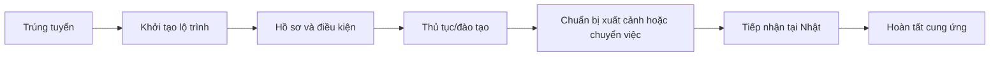

# UX-04. Lộ trình cung ứng nhân sự sang Nhật

## 1. Phạm vi

Supply Journey theo dõi quá trình từ khi ứng viên trúng tuyển đến khi hoàn tất cung ứng và bàn giao tại Nhật. Đây không phải hệ thống quản lý chuyến bay.

Tên và số mốc phụ thuộc Journey Template, nơi cư trú, tuyến visa, ngành nghề và trường hợp thực tế.

## 2. Journey Template

Quản trị viên có thể quản lý nhiều mẫu, ví dụ kỹ sư, kỹ năng đặc định, điều dưỡng, thực tập sinh hoặc mẫu theo khách hàng.

Mẫu định nghĩa:

- giai đoạn và milestone;
- thứ tự/phụ thuộc;
- thời hạn mặc định;
- vai trò chịu trách nhiệm;
- hồ sơ/evidence bắt buộc;
- điều kiện hoàn thành;
- mẫu email liên quan.

Khi khởi tạo, journey giữ snapshot/version của template. Sửa template không làm thay đổi âm thầm journey đang hoạt động.

## 3. Invariant một journey hoạt động

Một Candidate có thể có nhiều journey lịch sử từ các Application khác nhau nhưng chỉ tối đa một journey đang hiệu lực (`ACTIVE` hoặc `ON_HOLD`). Journey giữ cả `candidate_id` và `application_id`; backend lấy `candidate_id` từ Application và DB dùng partial unique index theo Candidate để cưỡng chế. Hủy journey cần lý do, actor, timestamp và giữ toàn bộ milestone/tệp/audit trước khi được tạo journey mới.

## 4. Saved view và bảng

View: Cần xử lý, Đúng tiến độ, Có nguy cơ chậm, Đã quá hạn, Chờ ứng viên, Chờ đối tác, Sắp hoàn tất, Đã hoàn tất, Đã hủy.

| Cột | Nội dung |
|---|---|
| Ứng viên | Mã và họ tên |
| Đơn tuyển | Đơn tạo kết quả trúng tuyển |
| Khách hàng | Đơn vị tiếp nhận |
| Mẫu lộ trình | Tên và version |
| Mốc hiện tại | Milestone đang xử lý |
| Hạn gần nhất | Hạn tiếp theo |
| Tiến độ | Số mốc hoàn tất/tổng mốc áp dụng |
| Tình trạng | Đúng hạn, Có nguy cơ, Quá hạn |
| Phụ trách | Điều phối viên |
| Hoạt động cuối | Thời gian cập nhật gần nhất |

Không dùng icon máy bay, đồng hồ hoặc cảnh báo lặp lại trong từng dòng.

## 5. Trạng thái

Journey: `Đang thực hiện`, `Tạm dừng`, `Hoàn tất`, `Đã hủy`.

Tình trạng tính toán: `Đúng tiến độ`, `Có nguy cơ chậm`, `Đã quá hạn`.

Milestone lưu các trạng thái lõi:

- `Chưa bắt đầu`
- `Đang xử lý`
- `Bị chặn`
- `Hoàn tất`
- `Không áp dụng`
- `Được miễn`

Các nhãn `Chờ ứng viên` và `Chờ khách hàng hoặc đối tác` là view vận hành từ `BLOCKED` kết hợp `blocker_party`, không phải enum milestone riêng. `Không áp dụng` nghĩa là milestone không thuộc trường hợp. `Được miễn` nghĩa là milestone bình thường bắt buộc nhưng đã được người có thẩm quyền miễn; cần lý do, approver và evidence theo policy.

## 6. Trang chi tiết

Header hiển thị Candidate, Client/Order, template/version, owner, trạng thái, milestone hiện tại, hạn gần nhất và ngày dự kiến hoàn tất.

Các tab:

| Tab | Nội dung |
|---|---|
| Tiến độ | Danh sách milestone theo thứ tự/phụ thuộc |
| Hồ sơ | Bắt buộc, đã nhận, chờ xác minh, cần bổ sung, sắp hết hạn, N/A, waived |
| Công việc | Task phát sinh từ milestone |
| Email | Chuỗi email liên quan journey |
| Lịch sử | Thay đổi trạng thái, hạn, owner, tệp, miễn và hủy/hoàn tất |

Mỗi milestone có owner, ngày dự kiến/thực tế, trạng thái, điều kiện hoàn thành, evidence, blocker, ghi chú và phụ thuộc. Chỉ milestone hiện tại/có vấn đề mở rộng mặc định; không biến toàn trang thành timeline trang trí.

## 7. Thông tin chuẩn bị xuất cảnh

Chỉ xuất hiện khi template có milestone tương ứng:

- ngày dự kiến;
- điểm khởi hành/điểm đến;
- thông tin chuyến đi nếu có;
- đơn vị/người tiếp nhận;
- thông tin bàn giao;
- tệp xác nhận.

Journey hoàn tất dựa trên điều kiện cung ứng và tiếp nhận, không chỉ vì chuyến bay đã diễn ra. Trường hợp ứng viên đang ở Nhật có thể dùng flow chuyển việc/đổi tư cách và không có mốc xuất cảnh.

## 8. Công việc và cảnh báo

Milestone đến hạn, quá hạn, bị chặn hoặc chờ phản hồi có thể tạo task ở “Việc của tôi”. Tình trạng rủi ro do hệ thống tính phải giải thích được từ hạn, dependency và trạng thái; người dùng không sửa trực tiếp nhãn rủi ro.

## 9. Phân quyền và audit

- Recruiter xem journey liên quan record được giao.
- Điều phối Nhật tạo/cập nhật milestone và hồ sơ theo quyền.
- Manager phê duyệt miễn, hủy hoặc ngoại lệ theo policy.
- Admin cấu hình template nhưng không mặc định đọc hồ sơ.
- Mọi thay đổi owner, hạn, trạng thái, evidence, miễn, hoàn tất/hủy đều có audit.

## 10. Tiêu chí nghiệm thu

- API/DB chặn journey hoạt động thứ hai cho cùng Candidate.
- Journey giữ đúng snapshot template khi template mới được phát hành.
- Milestone phụ thuộc không thể hoàn tất trái guard đã cấu hình.
- `Không áp dụng` và `Được miễn` được lưu/hiển thị khác nhau.
- Waiver cần quyền, lý do và approver/evidence theo cấu hình.
- Trường xuất cảnh chỉ xuất hiện theo template và không quyết định một mình trạng thái journey.
- Task/cảnh báo drill-down được về đúng milestone và owner.
