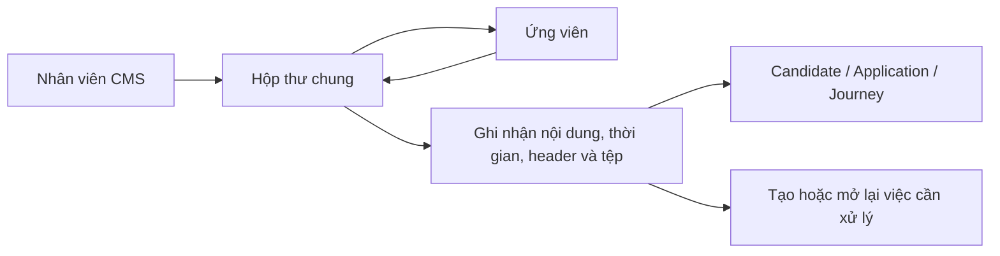

# UX-05. Hộp thư chung và giao tiếp ứng viên

## 1. Mô hình vận hành

MVP dùng một địa chỉ email doanh nghiệp chính thức. Ứng viên nhận và phản hồi bằng email thông thường, không có tài khoản CMS.

Một mailbox không có nghĩa mọi thư nằm trong một danh sách vô tổ chức. Conversation phải được gắn đúng Candidate và ngữ cảnh nghiệp vụ; trường hợp không chắc chắn vào hàng chờ thủ công.

## 2. Saved view Shared Inbox

- Cần xử lý.
- Được giao cho tôi.
- Chưa phân công.
- Chờ ứng viên phản hồi.
- Chờ nội bộ xử lý.
- Không xác định được ứng viên.
- Đã gửi.
- Gửi thất bại.
- Đã hoàn tất.

## 3. Bảng conversation

| Cột | Nội dung |
|---|---|
| Người gửi/nhận | Địa chỉ và tên hiển thị |
| Tiêu đề | Subject mới nhất |
| Ứng viên | Candidate đã liên kết |
| Ngữ cảnh | Application, Interview hoặc Journey |
| Phụ trách | Owner conversation |
| Trạng thái xử lý | Cần xử lý, Chờ phản hồi, Hoàn tất... |
| Email gần nhất | Thời gian nhận/gửi |
| Tệp đính kèm | Hiển thị bằng chữ, không dùng icon kẹp giấy duy nhất |

## 4. Màn hình conversation

Panel ngữ cảnh hiển thị Candidate, JobOrder, Client, Application/Journey, owner và task đang mở.

Nội dung trao đổi:

- sắp theo thời gian;
- phân biệt gửi đi/nhận vào;
- hiển thị From/To/Cc, timestamp và trạng thái;
- sanitize HTML trước khi render;
- tệp hiển thị tên, loại, dung lượng và scan status;
- message đã gửi/nhận không thể sửa.

Ghi chú nội bộ có nhãn `Chỉ nội bộ`, bề mặt riêng và không được chèn vào email reply.

## 5. Soạn email

Form gồm From cố định, To/Cc theo quyền, subject, template, nội dung, attachment, chữ ký, context liên kết và preview.

Hành động chính dùng chữ: `Lưu bản nháp`, `Gửi email`. Không dùng icon-only.

Template nghiệp vụ gồm mời/đổi lịch phỏng vấn, yêu cầu hồ sơ, thông báo kết quả, nhắc hạn và milestone cung ứng. Template có version; biến bắt buộc thiếu phải chặn gửi và chỉ rõ dữ liệu cần bổ sung.

## 6. Gửi bất đồng bộ và trạng thái

Email đi:

- `Bản nháp`
- `Đang chờ gửi`
- `Đang gửi`
- `Đã gửi`
- `Gửi thất bại`
- `Bị trả lại`

Email đến:

- `Đã nhận`
- `Đang xử lý`
- `Không liên kết được`
- `Bị cách ly`
- `Đã ghi nhận`

Chỉ hiển thị delivered/opened khi có evidence từ provider/policy; không suy đoán ứng viên đã đọc. Retry phải idempotent, không tạo email logic trùng.

## 7. Tự động liên kết reply

Thứ tự ưu tiên:

1. `Message-ID`, `In-Reply-To`, `References`.
2. Conversation/thread đã biết.
3. Email Candidate.
4. Mã tham chiếu nghiệp vụ.

Nếu không xác định chắc chắn, email vào `Không xác định được ứng viên`. Nhân viên liên kết thủ công và thao tác được audit. Không tự tạo Candidate mới khi chưa xác nhận. Nếu một địa chỉ thuộc nhiều hồ sơ, bắt buộc review thủ công.

## 8. Tệp đính kèm

Mỗi tệp giữ email nguồn, Candidate/context, timestamp, sender, tên/loại/dung lượng, checksum, scan status và lịch sử tải xuống.

Tệp chưa quét hoặc nguy hiểm không được mở trực tiếp. Nhãn: `Đang kiểm tra`, `An toàn`, `Bị cách ly`, `Không hỗ trợ`.

## 9. Phân công và chống xử lý trùng

- Một owner chính cho mỗi conversation.
- Người khác xem theo scope quyền.
- Khi một người đang soạn, người khác thấy trạng thái đó.
- Trước khi gửi, kiểm tra conversation có message mới.
- Reply mới tạo/mở lại task.
- Không cho hai thao tác retry tạo hai email gửi thực tế.

## 10. Lưu vết

Lưu actor, body, timestamp, header liên quan, attachment, template/version, các lần gửi/retry, lỗi/bounce, người liên kết, đổi owner, ghi chú nội bộ và lượt tải tệp nhạy cảm. Message bất biến; correction nghiệp vụ phải là sự kiện mới.

## 11. Trạng thái lỗi

- Mất kết nối mailbox.
- Credential hết hiệu lực.
- Gửi timeout/chưa xác định kết quả.
- Template thiếu biến.
- Attachment vượt giới hạn hoặc bị cách ly.
- Reply không ghép được.
- Conversation vừa có message mới trong lúc soạn.

Thông báo phải đưa ra hành động tiếp theo an toàn, không khuyến khích nhấn gửi lại mù quáng.

## 12. Tiêu chí nghiệm thu

- Reply đúng thread được lưu đủ nội dung, thời gian, header và tệp.
- Matcher mơ hồ đưa vào review, không tự đoán.
- Email đến không tự đổi kết quả phỏng vấn/visa/journey.
- Retry không gửi trùng và lưu mọi lần thử.
- Nội dung/tệp ngoài quyền không bị lộ qua search, preview hoặc URL.
- Ghi chú nội bộ không xuất hiện trong payload email.
- Tệp quarantine bị chặn tải và có audit.
